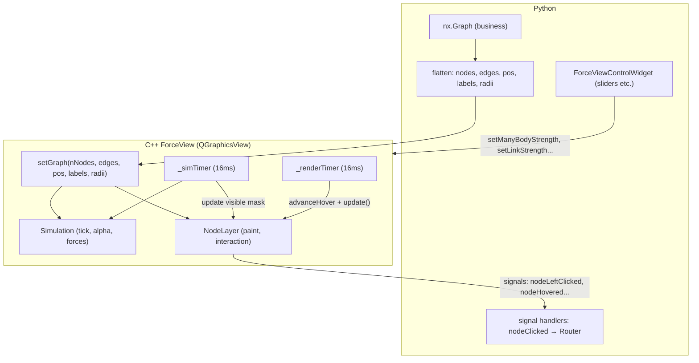

# Force Graph Python-to-C++ Port

## Architecture: Remove Multi-Process, Single-Process QTimer

Current Python architecture:

- Main process: `ForceView` + `NodeLayer` + `ForceGraphController` (rendering, interaction, IPC client)
- Child process: `Simulation` + `Forces` (physics tick, writes shared memory)
- Bridge: `Pipe` IPC + `SharedMemory` for pos array

New C++ architecture:

- **Single process**. `ForceView` owns a `Simulation` object and a `NodeLayer`.
- A `QTimer` drives `simulation.tick()` then `nodeLayer->update()` — no IPC, no shared memory, no Pipe.
- Python calls `ForceView.setGraph(...)` with flattened arrays from `nx.Graph`; connects to Qt signals for business events.




---

## File Plan (all under `cpp_bindings/forced_direct_view/`)

### New Files


| File                     | Maps From (Python)                          | Responsibility                                                                    |
| ------------------------ | ------------------------------------------- | --------------------------------------------------------------------------------- |
| `include/PhysicsState.h` | `PhysicsState` in `simulation_worker.py`    | POD: pos, vel, mass, dragging, edges as `std::vector<float>` / `std::vector<int>` |
| `include/Forces.h`       | `CenterForce`, `LinkForce`, `ManyBodyForce` | Force interface + 3 implementations                                               |
| `include/Simulation.h`   | `Simulation`                                | Tick loop, integrate, alpha decay, start/stop/pause                               |
| `src/Forces.cpp`         | Numba kernels + Force classes               | C++ O(N^2) brute force + block tiling for ManyBody                                |
| `src/Simulation.cpp`     | `Simulation.tick()`, `integrate()`          | Physics stepping                                                                  |
| `include/NodeLayer.h`    | `NodeLayer(QGraphicsObject)`                | Header for rendering layer                                                        |
| `src/NodeLayer.cpp`      | ~750 lines of NodeLayer                     | Edge/node/text drawing, hover animation, mouse events                             |
| `include/ForceView.h`    | `ForceView(QGraphicsView)`                  | Header for main view                                                              |
| `src/ForceView.cpp`      | ForceView + partial Controller logic        | Scene, timers, simulation lifecycle, wheel zoom                                   |
| `bindings.h`             | (new)                                       | `#include "ForceView.h"` for Shiboken                                             |
| `bindings.xml`           | (new)                                       | Expose `ForceView` as `<object-type>`                                             |


### Modified Files


| File             | Change                                                                                                                |
| ---------------- | --------------------------------------------------------------------------------------------------------------------- |
| `CMakeLists.txt` | Rewrite: build `forceviewlib.dll` shared library + Shiboken binding `PyForceView.pyd`; remove old color wheel sources |
| `src/main.cpp`   | Rewrite: standalone test that creates ForceView with random graph                                                     |


### Removed Files (no longer needed)

- `include/MainWindow.h`, `src/MainWindow.cpp` — test scaffold, replaced by new main.cpp
- `include/MyCustomWidget.h`, `src/MyCustomWidget.cpp` — color wheel code, belongs in `color_wheel/`

---

## Key C++ Classes

### PhysicsState (`include/PhysicsState.h`)

```cpp
struct PhysicsState {
    int nNodes = 0;
    std::vector<float> pos;      // flat [x0,y0, x1,y1, ...], size 2*N
    std::vector<float> vel;      // flat, size 2*N
    std::vector<float> mass;     // size N, default 1.0
    std::vector<bool>  dragging; // size N
    std::vector<int>   edges;    // flat [src0,dst0, ...], size 2*E
    int edgeCount() const { return (int)edges.size() / 2; }
};
```

Directly mirrors Python `PhysicsState`. No shared memory; same-process pointer.

### Force Hierarchy (`include/Forces.h`)

```cpp
class Force {
public:
    virtual ~Force() = default;
    virtual void initialize(PhysicsState* state) { m_state = state; }
    virtual void apply(float alpha) = 0;
protected:
    PhysicsState* m_state = nullptr;
};

class CenterForce : public Force { /* cx, cy, strength */ };
class LinkForce   : public Force { /* k, distance */ };
class ManyBodyForce : public Force { /* strength, cutoff2, block kernel */ };
```

`ManyBodyForce::apply()` uses the **block-tiled O(N^2)** kernel from Python's `manybody_block_kernel` for N < 2000, and a simple parallel kernel (with `#pragma omp parallel for` if OpenMP available) for larger N.

### Simulation (`include/Simulation.h`)

```cpp
class Simulation {
public:
    explicit Simulation(PhysicsState* state);
    void addForce(const std::string& name, std::unique_ptr<Force> force);
    void tick();          // apply forces → integrate → cool alpha
    void start();
    void stop();
    void pause();
    void resume();
    void restart();
    bool isActive() const;
private:
    float integrate();    // velocity decay → clamp → update pos
    PhysicsState* m_state;
    std::unordered_map<std::string, std::unique_ptr<Force>> m_forces;
    float m_alpha = 1.0f, m_alphaDecay = 0.01f, m_alphaMin = 0.001f;
    float m_velocityDecay = 0.75f, m_dt = 0.1f, m_maxDisp = 15.0f;
    bool m_active = false;
    int m_tickCount = 0, m_cooldownDelay = 150;
};
```

### NodeLayer (`include/NodeLayer.h`, `src/NodeLayer.cpp`)

Derived from `QGraphicsObject`. Responsible for:

- **Rendering**: `paint()` calls `drawEdges()`, `drawNodesAndText()` — directly ports the Python `NodeLayer.paint()` logic with group-based batch drawing and LOD text.
- **Interaction**: `mousePressEvent`, `mouseMoveEvent`, `mouseReleaseEvent`, `hoverMoveEvent` — hit detection against visible nodes, emit Qt signals (`nodeLeftClicked(int)`, etc.).
- **Hover animation**: `_hover_global` float 0..1, stepped in `advanceHover()`.
- **Visibility culling**: `updateVisibleMask()` computes `visible_indices` and `visible_edges` from viewport rect.

**NOT ported**: `draw_images()` (business-specific actress/work images). This can be added later via a callback/signal mechanism.

### ForceView (`include/ForceView.h`, `src/ForceView.cpp`)

Merges the roles of Python `ForceView` + partial `ForceGraphController` (simulation lifecycle, no IPC).

Public API for Python:

```cpp
class ForceView : public QGraphicsView {
    Q_OBJECT
public:
    explicit ForceView(QWidget* parent = nullptr);
    ~ForceView();

    // --- Graph Data (from Python flattened nx) ---
    void setGraph(int nNodes,
                  const QVector<int>& edges,    // flat [src,dst,...], len 2*E
                  const QVector<float>& pos,    // flat [x,y,...], len 2*N
                  const QStringList& labels,    // len N
                  const QVector<float>& radii); // len N (node display radii)

    // --- Simulation Control ---
    void pauseSimulation();
    void resumeSimulation();
    void restartSimulation();

    // --- Force Parameters ---
    void setManyBodyStrength(float v);
    void setCenterStrength(float v);
    void setLinkStrength(float v);
    void setLinkDistance(float v);

    // --- Visual Parameters ---
    void setRadiusFactor(float f);
    void setSideWidthFactor(float f);
    void setTextThresholdFactor(float f);

    // --- Misc ---
    void setDragging(int index, bool dragging);
    void setCenterNodeIndex(int index);
    QRectF getContentRect() const;

signals:
    void nodeLeftClicked(int index);
    void nodeRightClicked(int index);
    void nodeHovered(int index);
    void nodePressed(int index);
    void nodeReleased(int index);
    void scaleChanged(float scale);
    void fpsUpdated(float fps);
    void paintTimeUpdated(float ms);
    void tickTimeUpdated(float ms);
};
```

Internal timer wiring (replaces multi-process):

```
_simTimer (16ms):
    if simulation.isActive():
        simulation.tick()
        nodeLayer->updateVisibleMask()
        emit tickTimeUpdated(elapsed)
        _idleTimer.start()  // reset idle countdown

_renderTimer (16ms):
    nodeLayer->advanceHover()
    nodeLayer->update()  // triggers paint

_idleTimer (1000ms, singleShot):
    if !simulation.isActive() && !dragging && hover==-1:
        _renderTimer.stop()
```

---

## Shiboken Bindings

Following the `color_wheel` pattern:

`**bindings.h**`:

```cpp
#include "ForceView.h"
```

`**bindings.xml**`:

```xml
<typesystem package="PyForceView">
    <load-typesystem name="typesystem_widgets.xml" generate="no"/>
    <object-type name="ForceView"/>
</typesystem>
```

**CMakeLists.txt**: Build `forceviewlib.dll` (shared library) + use `shiboken_generator_create_binding()` to produce `PyForceView.pyd`. Install both to `${CMAKE_CURRENT_SOURCE_DIR}` so Python can `import PyForceView`.

---

## Python Side Usage (NOT part of this task, for reference)

```python
from PyForceView import ForceView

# Inside a Python wrapper / ForceViewControlWidget:
view = ForceView(parent)
nodes = list(G.nodes())
node_index = {n: i for i, n in enumerate(nodes)}
edges_flat = []
for u, v in G.edges():
    edges_flat.extend([node_index[u], node_index[v]])
pos_flat = [...]  # initial positions
labels = [str(G.nodes[n].get("label", n)) for n in nodes]
radii = compute_node_radii(G).tolist()

view.setGraph(len(nodes), edges_flat, pos_flat, labels, radii)
view.nodeLeftClicked.connect(on_node_clicked)
```

---

## What is NOT ported to C++

- `ForceViewControlWidget` (control panel UI) — stays in Python
- `ForceGraphController` — its IPC logic is eliminated; simulation lifecycle moves into `ForceView`; graph building from `nx.Graph` stays in Python
- `ReceiverThread`, `SimulationClient`, `simulation_process_main` — entirely eliminated
- `RenderState` — replaced by internal C++ state in ForceView/NodeLayer
- `AsyncImageLoader` and `draw_images()` — business-specific, stays in Python (can be added later)
- `GraphViewSession`, `graph_manager` integration — Python-side business logic

