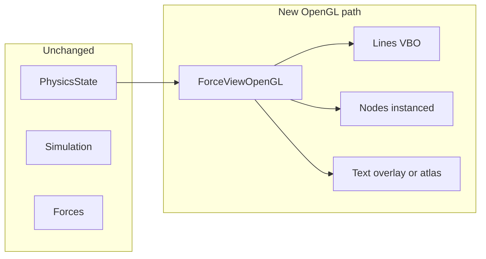

# ForceView OpenGL 显示层方案

## 目标与约束

- **只改显示层**：不修改 [ForceView.cpp](cpp_bindings/forced_direct_view/src/ForceView.cpp)、[NodeLayer](cpp_bindings/forced_direct_view/include/NodeLayer.h)、[Simulation](cpp_bindings/forced_direct_view/include/Simulation.h)、[PhysicsState](cpp_bindings/forced_direct_view/include/PhysicsState.h)、Forces 等模拟/计算相关代码。
- **新文件**：仅新增 `ForceViewOpenGL.h`、`ForceViewOpenGL.cpp`，通过 CMake 加入现有库或可执行目标。
- **功能对等**：点（节点）、线（边）、文字（标签）+ 原有动效（hover 淡入淡出、dim/highlight、中心节点高亮、拖拽节点）。

---

## 架构与数据流

- **ForceViewOpenGL** 与现有 **ForceView** 平行：同一套公开 API（`setGraph`、仿真控制、视觉参数、信号），内部用 **QOpenGLWidget** 替代 QGraphicsView + NodeLayer，**复用** `PhysicsState` 与 `Simulation`（只读/调用，不改其实现）。
- 仿真与计时逻辑从 ForceView **复制**到 ForceViewOpenGL（setGraph 建图、sim 线程、onSimTick/onRenderTick），避免改动原 ForceView 文件；显示相关状态（可见性、hover、分组、边线缓冲）在 OpenGL 类内用与 NodeLayer 相同的算法维护。

---

## 1. ForceViewOpenGL 类设计

- **基类**：`QOpenGLWidget`（Qt6 中仍在 Qt Widgets 中），以便直接做 OpenGL 绘制并接收鼠标/滚轮事件。
- **与 ForceView 对齐的 API**（签名一致，便于 main 或上层二选一）：
  - `setGraph(nNodes, edges, pos, id, labels, radii, nodeColors)`
  - `pauseSimulation` / `resumeSimulation` / `restartSimulation`
  - `setManyBodyStrength` / `setCenterStrength` / `setLinkStrength` / `setLinkDistance`
  - `setRadiusFactor` / `setSideWidthFactor` / `setTextThresholdFactor`
  - `setCenterNodeIndex` / `setDragging` / `getContentRect`
  - 同一套 signals：`nodeLeftClicked`、`nodeRightClicked`、`nodeHovered`、`nodePressed`/`nodeReleased`、`scaleChanged`、`fpsUpdated`、`paintTimeUpdated`、`tickTimeUpdated`、`simulationStarted`/`simulationStopped`。
- **内部持有**（与 ForceView + NodeLayer 对应，但不引用 NodeLayer）：
  - `std::unique_ptr<PhysicsState> m_physicsState`
  - `std::unique_ptr<Simulation> m_simulation`，sim 线程、mutex、timers（sim/render/idle）
  - 图元数据：`m_neighbors`、`m_ids`、`m_idToIndex`、`m_labels`、`m_showRadiiBase`、`m_nodeColors`、力参数等
  - **显示状态**（从 NodeLayer 逻辑移植）：`m_visibleIndices`、`m_visibleEdges`、`m_nodeMask`、`m_groupBase`/`m_groupDim`/`m_groupHover`/`m_groupHighlight`、`m_hoverIndex`、`m_lastHoverIndex`、`m_hoverGlobal`、`m_neighborMask`、`m_lastNeighborMask`、边线缓存（dim/highlight/all 的顶点数据）、`m_centerNodeIndex`、拖拽状态等
  - **视图状态**：`m_panX`、`m_panY`、`m_zoom`（用于 2D 视图矩阵，替代 QGraphicsView 的 transform）

---

## 2. 显示管线（仅改显示层）

### 2.1 可见性与动效（CPU，与 NodeLayer 一致）

- **updateVisibleMask()**：根据当前视口（由 `m_pan`/`m_zoom` 和 widget 尺寸算出“场景可见矩形”）做节点/边裁剪，填充 `m_visibleIndices`、`m_visibleEdges`、`m_nodeMask`。逻辑与 [NodeLayer::updateVisibleMask](cpp_bindings/forced_direct_view/src/NodeLayer.cpp)（约 204–262 行）一致，仅“可见矩形”改为由 OpenGL 视图矩阵反算。
- **advanceHover()**：与 NodeLayer 相同：`m_hoverGlobal` 向 0/1 步进，并更新边线缓冲（dim/highlight/all）。
- **边线缓冲**：等价于 NodeLayer 的 `updateEdgeLineBuffers()`，但输出为 **float 数组**（每线 4 个 float：x1,y1,x2,y2）供 OpenGL 线 VBO 使用；三类线（all / dim / highlight）对应 1～3 个 draw call。
- **节点分组与最终颜色**：每帧在 CPU 按 `m_hoverIndex`、`m_hoverGlobal`、`m_centerNodeIndex`、`m_neighborMask` 将可见节点分为 base/dim/hover/highlight，用与 NodeLayer 相同的 `mixColor` 和默认色（及可选的 `m_nodeColors[i]`）计算**每节点最终颜色**，写入节点 instance 数据（位置、半径、颜色），不修改 Simulation/PhysicsState 的计算。

### 2.2 平移与缩放（2D 视图矩阵）

- 在 OpenGL 中自己维护 2D 视图矩阵（例如 `scale(zoom) * translate(panX, panY)`），在顶点 shader 中乘到场景坐标上，得到裁剪空间坐标。
- **wheelEvent**：修改 `m_zoom`（并限制范围），可选以鼠标位置为缩放中心（与 ForceView 的 AnchorUnderMouse 行为一致）。
- **鼠标拖拽**：未拖节点时平移 `m_panX`/`m_panY`；拖节点时与现有逻辑一致，更新 `PhysicsState::setDragPos` / `updateRenderPosAt`，不改 Simulation 内部。

### 2.3 OpenGL 绘制顺序与方式

1. **线（边）**
  - 每帧用当前 `m_linesAll` / `m_linesDim` / `m_linesHighlight` 的 float 顶点更新 VBO（或双缓冲），用 **GL_LINES** 绘制；颜色用 uniform 或 per-batch 一致（与 NodeLayer 的 pen 颜色一致）。
2. **点（节点）**
  - **Instanced 绘制**：单位圆（或 quad）mesh + instance 属性（中心 x,y、半径、最终颜色 RGBA）。每帧根据可见节点与分组结果填充 instance 数据并上传，一次 `glDrawArraysInstanced`（或按颜色组分批，与现有 draw 顺序一致）。
3. **文字（标签）**
  - **阶段一（推荐先做）**：在 `paintGL` 里用 **QPainter + QOpenGLPaintDevice** 只画文字：先做 OpenGL 的线、点，再 `QPainter::begin(openGLPaintDevice)`，用与 NodeLayer 相同的 LOD（scale &gt; m_textThresholdOff 才画）、相同位置与字体，画 `drawStaticText`/`drawText`。这样不改模拟、不改其他文件，仅显示层用 OpenGL 画几何，文字仍用 Qt。
  - **阶段二（可选）**：后续可改为纹理图集 + 四边形，完全用 OpenGL 画文字，以进一步提升性能。

### 2.4 交互（命中检测与信号）

- 将**屏幕坐标**用当前视图矩阵的**逆**变换到**场景坐标**，在可见节点中找距离最近且落在半径内的节点（与 [NodeLayer 的 mousePress/hoverMove](cpp_bindings/forced_direct_view/src/NodeLayer.cpp) 约 618–766 行逻辑一致）；命中则更新 `m_hoverIndex`、`m_selectedIndex`、拖拽偏移等，并 emit 与 ForceView 相同的 signals（nodeId 用 `m_ids[index]`）。
- 不修改 PhysicsState/Simulation 的接口；拖拽时只调用现有的 `setDragPos`、`updateRenderPosAt` 等。

---

## 3. 文件与构建

| 项                       | 说明                                                                                                                                                                                                                  |
| ----------------------- | ------------------------------------------------------------------------------------------------------------------------------------------------------------------------------------------------------------------- |
| **ForceViewOpenGL.h**   | 声明 `ForceViewOpenGL : public QOpenGLWidget`，与 ForceView 对齐的 public API 与 signals，以及上述成员（physics、sim、图元数据、显示状态、视图矩阵、GL 相关句柄等）。                                                                                       |
| **ForceViewOpenGL.cpp** | 实现 setGraph（复制 ForceView 的建图与 sim 启动逻辑）、仿真线程与 timers、onSimTick/onRenderTick、updateVisibleMask/advanceHover/边线缓冲、initializeGL/resizeGL/paintGL、鼠标/滚轮事件与命中检测、信号转发。不包含 NodeLayer 或 ForceView 的 include。                |
| **CMakeLists.txt**      | 将 `ForceViewOpenGL.cpp`、`ForceViewOpenGL.h` 加入现有 `forceview_library` 的源列表；如需显式链接 OpenGL，则对 `forceviewlib` 增加 `target_link_libraries(... OpenGL::GL)` 或平台等价项（如 Windows 的 opengl32）。不删除或修改现有 ForceView/NodeLayer 的构建。 |

---

## 4. 与现有代码的边界

- **只读/调用**：`PhysicsState`（`renderPosData()`、`nNodes`、`edgeCount()`、`edges`、`setDragPos`、`updateRenderPosAt`）、`Simulation`（`tick()`、`isActive()`、`start`/`stop`/`pause`/`resume`/`restart`）、Forces（通过 Simulation 的 `getForce` 等）。这些类**不修改**。
- **不引用**：不 include 或使用 `NodeLayer`、`ForceView`；逻辑从 NodeLayer/ForceView **复制**到 ForceViewOpenGL，保证“只改显示层”且原路径仍可用。
- **main / 测试**：可在 `main.cpp` 或单独的可执行目标中通过宏或命令行选择创建 `ForceView` 或 `ForceViewOpenGL`，便于对比；此为可选，不强制改现有 main。

---

## 5. 实现顺序建议

1. **ForceViewOpenGL.h**：类声明、API 与成员、GL 相关句柄占位。
2. **ForceViewOpenGL.cpp**：
  - setGraph + 仿真线程 + timers（复制自 ForceView），不创建 NodeLayer。  
  - initializeGL：编译链接着色器（2D 线、2D 圆 instanced），创建 VBO/VAO。  
  - 实现 updateVisibleMask、advanceHover、边线 float 缓冲与节点分组/颜色。  
  - resizeGL：视口 + 投影/视图矩阵（或仅视图矩阵，投影用正交）。  
  - paintGL：更新线/节点 VBO，绘制线再节点；再 QPainter 画文字（阶段一）。  
  - 鼠标/滚轮：pan、zoom、命中检测与 signals。
3. **CMake**：加入新源文件并链接 OpenGL（如需要）。
4. （可选）将 main 或测试改为可切换 ForceView / ForceViewOpenGL 做验证。

按此方案，点、线、文字和原有动效都在新类中实现，且**不修改任何模拟/计算相关文件**，仅新增显示层实现文件并接入现有库。