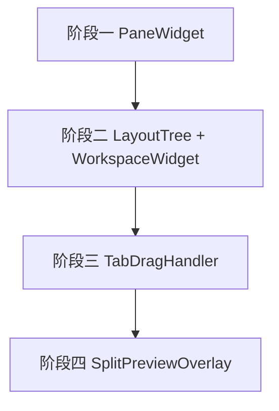

# 自研工作区窗格 Demo 实施计划

## 目标与范围

在 `ui/demo/` 下创建自研工作区布局 Demo，实现：窗格 = Tab 栏 + 内容区，支持动态分割、Tab 拖拽迁移、四边 20% 拆分预览、空窗格自动关闭。替换当前 `WorkspaceDemoPage` 引用的缺失 `workspace_widget` 模块。

---

## 模块划分与文件结构

```
ui/demo/
├── __init__.py                    # 导出 WorkspaceDemoWidget
├── workspace_widget.py            # 主入口：WorkspaceDemoWidget（根容器）
├── pane_widget.py                 # 阶段一：PaneWidget（窗格 = TabBar + StackedWidget）
├── layout_tree.py                 # 阶段二：布局树与 Splitter 动态管理
├── tab_drag_handler.py            # 阶段三：Tab 拖拽逻辑与几何计算
└── split_preview.py               # 阶段四：拆分预览图层（QRubberBand / QPainter）
```

---

## 阶段一：基础 Pane 封装

**目标**：单个窗格可独立运行，具备 Tab 栏 + 内容区联动。

### 1.1 PaneWidget（[ui/demo/pane_widget.py](ui/demo/pane_widget.py)）

- 组合 `QTabBar` + `QStackedWidget`，垂直布局（Tab 在上，内容在下）
- `QTabBar`：
  - `setMovable(True)` 支持 Tab 顺序拖拽（同窗格内）
  - 自定义 TabBar 子类，`setTabsClosable(True)` 支持关闭按钮
  - 关闭最后一个 Tab 时发出 `pane_empty` 信号（供阶段二处理 L4）
- `QStackedWidget`：每个 Tab 对应一个 `QWidget` 内容页
- 提供 `add_content(id, title, widget)`、`remove_content(id)`、`current_content_id()` 等接口

### 1.2 占位内容与 Demo 集成

- 创建简单占位内容（如 `QLabel` 显示 "内容 A/B/C"）
- 在 `workspace_widget.py` 中先放置单个 PaneWidget，验证基础联动

### 1.3 参考现有实现

- Tab 样式可复用 [styles/main.qss](styles/main.qss) 中 `QTabBar::tab` 相关定义
- 项目已有 [ui/widgets/VerticalTabBar.py](ui/widgets/VerticalTabBar.py)，本 Demo 使用水平 QTabBar 即可

---

## 阶段二：树状布局与动态分割

**目标**：用 QSplitter 递归组织多个 Pane，支持动态创建、嵌套与空窗格自毁。

### 2.1 LayoutTree（[ui/demo/layout_tree.py](ui/demo/layout_tree.py)）

- 数据结构：
  - `SplitNode`：持有 `QSplitter`、`orientation`（Horizontal/Vertical）、`children: list[SplitNode | PaneWidget]`
  - `PaneNode`：直接持有 `PaneWidget`
  - 根为 `SplitNode`，叶子为 `PaneWidget`
- 操作：
  - `split(pane: PaneWidget, direction: Qt.Orientation, insert_before: bool)`：将 pane 所在位置替换为 SplitNode，原 pane 与新 pane 为子节点
  - `remove_pane(pane)`：删除 pane，父 SplitNode 若只剩 1 子则折叠（用剩余子替换自身）
  - `serialize()` / `deserialize()`（可选，后续扩展）

### 2.2 WorkspaceWidget 根容器

- 持有一个根 `SplitNode`，其 `QSplitter` 作为 central widget
- 初始状态：单个 PaneWidget，内含若干 Tab
- 监听 PaneWidget 的 `pane_empty`，调用 `layout_tree.remove_pane()`
- QSplitter 样式参考 [ui/pages/PlotTabPage.py](ui/pages/PlotTabPage.py) 中 `QSplitter::handle` 的 QSS

### 2.3 QSplitter 动态创建与嵌套

- 拆分时：创建新 `QSplitter`，设置 `orientation`，用 `addWidget()` 加入原 Pane 和新 Pane
- 将父 Splitter 中对应位置 `replaceWidget()` 为新 Splitter
- 自毁：当 SplitNode 仅剩 1 子时，用该子 widget 替换 Splitter，递归向上合并

---

## 阶段三：拖拽重组（DND）

**目标**：通过拖拽 Tab 标题，实现跨窗格迁移与四边 20% 拆分。

### 3.1 TabDragHandler（[ui/demo/tab_drag_handler.py](ui/demo/tab_drag_handler.py)）

- 自定义 `DraggableTabBar(QTabBar)`：
  - `mousePressEvent` 记录起始位置
  - `mouseMoveEvent` 超出阈值时启动 `QDrag`，`QMimeData` 携带 `content_id`、`source_pane_id`、`widget` 等
- 每个 PaneWidget 作为 drop 目标：
  - `setAcceptDrops(True)`
  - `dragEnterEvent` / `dragMoveEvent`：根据鼠标在 Pane 内的相对位置计算落入哪个区域
  - 区域定义（规格 C3）：
    - 上 20%：`DropZone.TOP` → 上方拆分
    - 下 20%：`DropZone.BOTTOM` → 下方拆分
    - 左 20%：`DropZone.LEFT` → 左侧拆分
    - 右 20%：`DropZone.RIGHT` → 右侧拆分
    - 中间 60%×60%：`DropZone.CENTER` → 合并到当前窗格
  - `dropEvent`：根据 `DropZone` 调用 `LayoutTree.split()` 或 `PaneWidget.add_content()`
- 几何计算：`_hit_test(rect: QRect, pos: QPoint) -> DropZone`

### 3.2 拖拽后清理

- 若源 Pane 在移除 Tab 后为空，触发 `pane_empty`，由 LayoutTree 执行自毁

---

## 阶段四：拆分预览视觉反馈

**目标**：拖拽 Tab 悬停时，显示即将拆分的预览矩形。

### 4.1 SplitPreviewOverlay（[ui/demo/split_preview.py](ui/demo/split_preview.py)）

- 方案 A（推荐）：使用 `QRubberBand`
  - 在 WorkspaceWidget 上叠加一个全屏透明子 Widget，接收 `dragMoveEvent`
  - 根据 `TabDragHandler` 计算的 `DropZone` 和当前 Pane 的 `geometry()`，计算预览矩形
  - 创建 `QRubberBand(QRubberBand.Rectangle)`，`setGeometry()` 并 `show()`
  - `dragLeaveEvent` 或 `dropEvent` 时 `hide()` 并销毁
- 方案 B：自定义 `QWidget.paintEvent` 用 `QPainter.drawRect` 绘制半透明矩形
  - 需要手动处理 `update()` 和层级

### 4.2 预览矩形计算

- `TOP`：Pane 上半部分矩形
- `BOTTOM`：Pane 下半部分矩形
- `LEFT` / `RIGHT`：左右 20% 矩形
- `CENTER`：高亮当前 Pane 边框或 Tab 栏，表示合并

### 4.3 与 DND 集成

- `dragMoveEvent` 中根据 `_hit_test` 结果调用 `SplitPreviewOverlay.show_preview(zone, target_pane)`
- 拖拽结束清除预览

---

## 集成与路由

- 创建 [ui/demo/workspace_widget.py](ui/demo/workspace_widget.py)，组合上述模块
- 创建 [ui/demo/**init**.py](ui/demo/__init__.py)，导出 `WorkspaceDemoWidget`
- [ui/pages/WorkspaceDemoPage.py](ui/pages/WorkspaceDemoPage.py) 已引用 `from ui.demo.workspace_widget import WorkspaceDemoWidget`，无需修改

---

## 实施顺序与依赖




- 每阶段完成后均可独立运行 Demo
- 阶段二依赖阶段一；阶段三依赖阶段二；阶段四依赖阶段三的 DropZone 计算

---

## 验收检查点


| 阶段  | 验收项                                                     |
| --- | ------------------------------------------------------- |
| 一   | Pane 内 Tab 可移动、可关闭；Tab 与 StackedWidget 联动；关闭最后 Tab 发出信号 |
| 二   | 根容器显示 Splitter 树；拆分产生新 Pane；空窗格移除后相邻吸收                  |
| 三   | 拖拽 Tab 到四边 20% 触发拆分、到中心合并；跨 Pane 迁移正确                   |
| 四   | 拖拽悬停时显示预览矩形；松开后预览消失                                     |


---

## 技术要点摘要

- **Qt 版本**：PySide6 6.10.1（与 [requirements.txt](requirements.txt) 一致）
- **不依赖**：QtAds，纯 PySide6 实现
- **可选**：`manual_tests/test_workspace_demo.py` 用于独立启动 Demo 窗口验证

