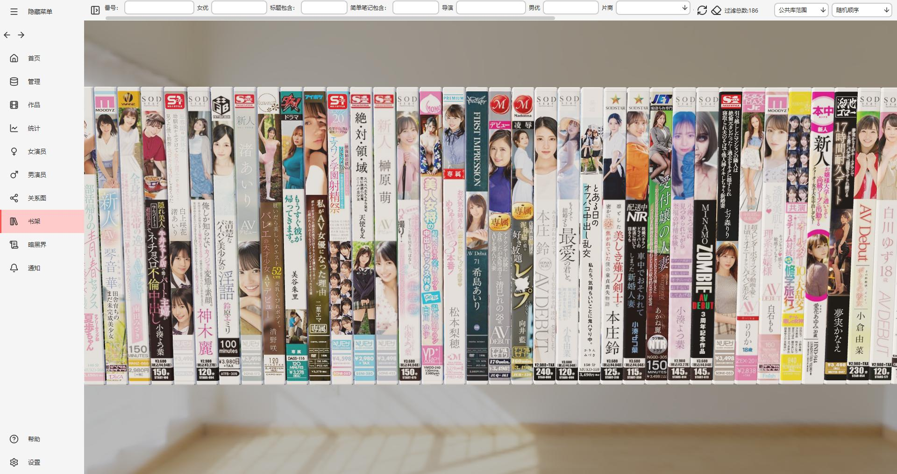
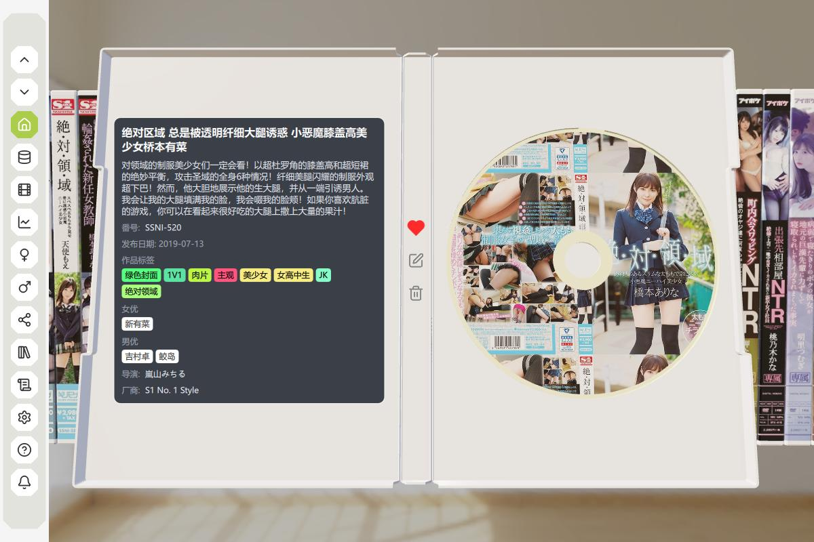
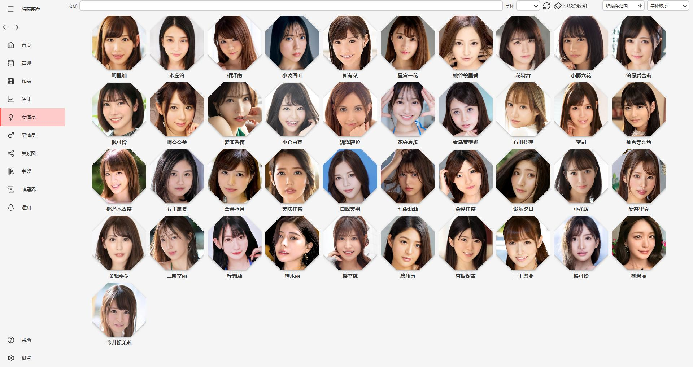
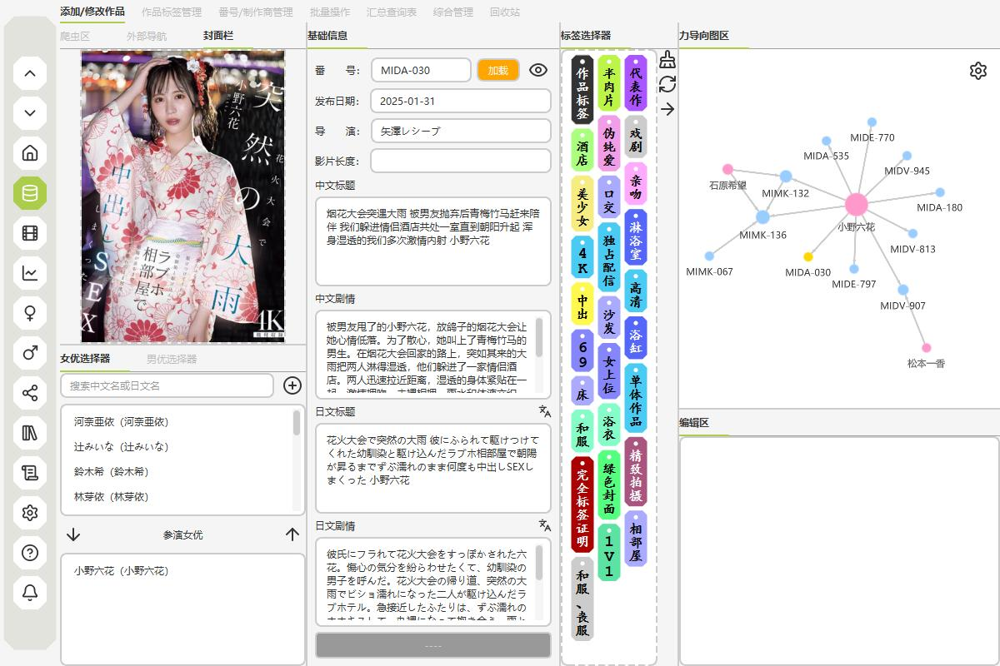
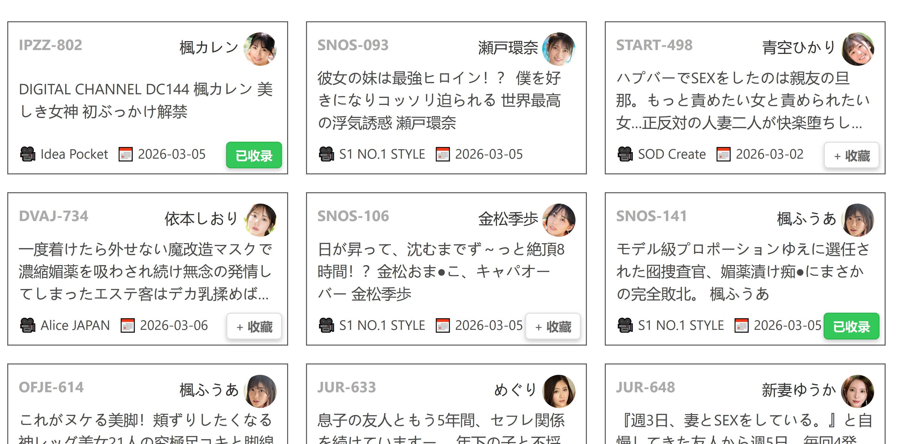

  
  <h1>DarkEye</h1>
  
<strong>暗黑界で、一つの目を開く</strong>

  
完全ローカル・プライバシー重視の成人向け動画コレクション／管理ツール。ブラウザ拡張による没入型の取得と、実物風 DVD ディスプレイに対応。

  
PySide6 / Qt Quick 3D、SQLite、ローカル FastAPI とブラウザ拡張の連携、および C++ によるフォースレイアウト・グラフの高速化を備え、取得・整理・分析・可視化をひとつにまとめたソフトウェアです。

   

[![README · 简体中文][badge-readme-zh-CN]](README.md)
[![README · 繁體中文][badge-readme-zh-TW]](README.zh-TW.md)
[![README · 日本語][badge-readme-ja]](README.ja.md)

![Python][badge-python]
![Framework][badge-framework]
![Platform][badge-platform]
![License][badge-license]
![GitHub last commit][badge-last-commit]
![GitHub release][badge-release]
![GitHub Repo stars][badge-stars]
![GitHub all releases][badge-downloads]

 

[📖 オンラインドキュメント][link-docs]
　[🎥 動画紹介][link-video]
　[🌐 公式サイト][link-website]
　[💬 Discord][link-discord]

  <a href="#features">機能</a> •
  <a href="#roadmap">開発の方向</a> •
  <a href="#download">ダウンロード</a> •
  <a href="#screenshots">画面プレビュー</a> •
  <a href="#privacy">プライバシーとデータ</a> •
  <a href="#migration">移行とインポート</a> •
  <a href="#crawler">クローラー</a> •
  <a href="#development">開発</a> •
  <a href="#documentation">ドキュメント</a> •
  <a href="#community">コミュニティ</a> •
  <a href="#references">参考プロジェクト</a>

  

---

## プライバシーとデータ

- **データと通信**：既定では実行ファイル近くの `data/` に保存（DB・設定・カバー画像など。設定で変更可）。コレクションを勝手にクラウドへ送ることはありません。通信は主にクローラーと画像等の取得、任意の更新確認（GitHub Releases）、翻訳（Google／設定した LLM API）などで発生します。

---

## 機能

### 実装済み

| **機能** | **説明** | **状態** |
| -------- | -------- | -------- |
| **資料管理** | 作品・女優・男優・タグの手動追加と CRUD、一部クローラー | ✅ |
| **記録** | 自慰・性交・朝立ち記録の手動追加と CRUD | ✅ |
| **分析** | 分析チャート・データ表示（一部未完了） | ✅ |
| **実物風 DVD** | 実物風 DVD ビューとコレクション体験 | ✅ |
| **絞り込み** | 作品の絞り込み画面 | ✅ |
| **ブラウザ拡張** | Chrome / Edge / Firefox 用拡張、没入型の取得、javtxt・javlib・javdb など対話的取得 | ✅ |
| **複数ソース** | javlib、avdanyuwiki、javtxt、javdb、minnano-av など。一般向け作品の取得に有効で、ボット対策の突破もしやすい | ✅ |
| **フォースレイアウト** | 関連の可視化、約 1 万ノードで 60 fps 目安 | ✅ |
| **ローカル動画** | ローカル動画の検索とクローラー一覧への追加 | ✅ |
| **バックアップ** | プライベートライブラリからお気に入り品番を再構築 | ✅ |
| **外部リンク** | JSON 設定駆動の外部リンクジャンプ（カスタム可） | ✅ |
| **テーマ** | テーマ切替（3D シーンはライト／ダーク未完全対応） | ✅ |
| **スクリーンショット** | 一部スクリーンショット、女優画面で C キー | ✅ |
| **NFO インポート** | NFO インポート（試験中） | ✅ |
| **mdcz NFO** | [mdcz](https://github.com/ShotHeadman/mdcz) 用 NFO のインポート | ✅ |
| **Jvedio NFO** | Jvedio からの NFO エクスポート（試験中） | ✅ |
| **自動更新** | 更新の自動検知とダウンロード | ✅ |
| **翻訳** | LLM 翻訳・ワンクリックで上書き翻訳 | ✅ |

### 計画・進行中

| **機能** | **説明** | **状態** |
| -------- | -------- | -------- |
| **NFO エクスポート** | 仕様の合意後に実装。ツールごとに実装差があり、データ項目も未整備 | 🔄 |

---

## 開発の方向

- **1.0**：基本ツールの完成（フォースレイアウト・グラフで作品関係の探索、コレクション体験の強化）
- **2.0**：UGC、分散同期
- **3.0**：機械学習によるレコメンド

---

## ダウンロードと拡張機能

[![Windows 版][badge-dl-app]][link-dl-app]

 

[![Chrome / Edge 拡張][badge-dl-chrome]][link-dl-chrome]　　
[![Firefox 拡張][badge-dl-firefox]][link-dl-firefox]

ZIP を展開し、`exe` を実行すれば利用できます。拡張機能はアプリの `extensions` フォルダに同梱されています。クローラー取得には、**お使いのブラウザ用を 1 つ**選び、下記ドキュメントに従ってインストールしてください。

### 拡張機能のインストール

👉 [オンラインドキュメント：インストール](https://de4321.github.io/darkeye/usage/#_2)

### 使い方

👉 [オンラインドキュメント：使い方](https://de4321.github.io/darkeye/usage/#_3)

### バージョンと更新

👉 [FAQ：更新と移行](https://de4321.github.io/darkeye/faq/)

設定から**本体**の自動更新が可能です。ブラウザ拡張はストア公開できないため、[Releases][link-releases] から手動で入手・更新が必要です。移行時は**拡張の更新**も忘れずに。クローラーは性質上すぐ失効することがあり、フィードバックに基づき手作業で修正します。プロキシ問題はソフト側では解決しません。対象サイトがブラウザで開ければ取得できます。

---

## 移行とインポート

### mdcz プロジェクトの NFO

[mdcz](https://github.com/ShotHeadman/mdcz) が出力した NFO のインポートに対応しています。

👉 [ドキュメント：mdcz NFO](https://de4321.github.io/darkeye/usage/#mdcz-nfo)

### Jvedio からのデータ移行

👉 [ドキュメント：Jvedio](https://de4321.github.io/darkeye/usage/#jvedio)

---

## 画面プレビュー

### 実物風 DVD

### フォースレイアウト・グラフ

### 分析チャート

### 複数作品（瀑布流）

### 編集画面

### ブラウザ拡張（javtxt の例）

拡張を有効にするとローカルアプリと連携し、「追加」でクローラーが起動してローカルに取り込みます。javlib・javdb にも対応。画面中央の「コレクション」「収録」はサイト単体には出ず、拡張とローカルアプリを開いたときだけ表示されます。

---

## クローラーについて

作品については、公開日、監督、中日タイトルとあらすじ、女優・男優（いれば）、タグ、カバー、再生時間、メーカー、レーベル、シリーズ、スチルなどを取得します。

女優については、アイコン、生年月日、デビュー日、スリーサイズ、身長・カップ、旧名など。旧名の更新ルートはまだありません。最初から旧名で登録していると不整合が出ることがあります。

初回の取得では javlib のボット対策が必ず発動します。およそ 100 回に 1 回程度 javdb のクリック確認が出ることもあり、手で通せば続行できます。

---

## 開発

👉 [開発ドキュメント](https://de4321.github.io/darkeye/development/)

---

## ドキュメント

👉 [完全なオンラインドキュメント](https://de4321.github.io/darkeye/)

---

## コミュニティ

質問やアイデアは Discord へ：[参加する][link-discord]

- **サポート**：ドキュメントで分からない点はお気軽に。内容は順次更新しています。
- **進捗**：新機能・開発状況・プレリリースはまず Discord で共有します。
- **ロードマップ**：方向性への参加も歓迎です。

---

## 参考プロジェクト

- [mdcz](https://github.com/ShotHeadman/mdcz)：ローカル動画ファイル名から品番を抽出するコードの参考、および NFO 互換の試み
- [Jvedio](https://github.com/hitchao/Jvedio)：データベース連携・データのエクスポート
- [JavSP](https://github.com/Yuukiy/JavSP)：一部サイトのクローラー実装の参考
- [JAV-JHS](https://sleazyfork.org/zh-CN/scripts/558525-jav-jhs)：javdb・FC2 などの情報取得の参考
- [JAV_MovieManager](https://github.com/4evergaeul/JAV_MovieManager)
- [stash](https://github.com/stashapp/stash)
- [AMMDS](https://github.com/QYG2297248353/AMMDS-Docker)
- [mdc-ng](https://github.com/mdc-ng/mdc-ng)

---

## コントリビューター

---

DarkEye — ローカルでコレクション、安心して整理。

<!-- Badge images -->

[badge-readme-zh-CN]: https://img.shields.io/badge/README%20%C2%B7%20%E7%AE%80%E4%BD%93%E4%B8%AD%E6%96%87-555555?style=for-the-badge
[badge-readme-zh-TW]: https://img.shields.io/badge/README%20%C2%B7%20%E7%B9%81%E9%AB%94%E4%B8%AD%E6%96%87%EF%BC%88%E8%87%BA%E7%81%A3%EF%BC%89-555555?style=for-the-badge
[badge-readme-ja]: https://img.shields.io/badge/README%20%C2%B7%20%E6%97%A5%E6%9C%AC%E8%AA%9E-2ea44f?style=for-the-badge
[badge-python]: https://img.shields.io/badge/Python-3.13-blue.svg
[badge-framework]: https://img.shields.io/badge/framework-PySide6%20(Qt6)-orange
[badge-platform]: https://img.shields.io/badge/Platform-Windows-blue
[badge-license]: https://img.shields.io/github/license/de4321/darkeye
[badge-last-commit]: https://img.shields.io/github/last-commit/de4321/darkeye
[badge-release]: https://img.shields.io/github/v/release/de4321/darkeye
[badge-stars]: https://img.shields.io/github/stars/de4321/darkeye?style=social
[badge-downloads]: https://img.shields.io/github/downloads/de4321/darkeye/total
[badge-dl-app]: https://img.shields.io/badge/DL-Windows-blue?style=for-the-badge&logo=windows
[badge-dl-chrome]: https://img.shields.io/badge/DL-Chrome%2FEdge%20ext-blue?style=for-the-badge
[badge-dl-firefox]: https://img.shields.io/badge/DL-Firefox%20ext-blue?style=for-the-badge

<!-- Links -->

[link-docs]: https://de4321.github.io/darkeye/
[link-video]: https://youtu.be/VCsw1D0ccgY?si=e9typx4kPnzaVFZq
[link-website]: https://de4321.github.io/darkeye-webpage/
[link-discord]: https://discord.gg/3thnEguWUk
[link-releases]: https://github.com/de4321/darkeye/releases
[link-dl-app]: https://github.com/de4321/darkeye/releases/download/v1.2.4/DarkEye-v1.2.4.zip
[link-dl-chrome]: https://github.com/de4321/darkeye/releases/download/v1.2.4/chrome_capture.zip
[link-dl-firefox]: https://github.com/de4321/darkeye/releases/download/v1.2.4/firefox_capture.zip
