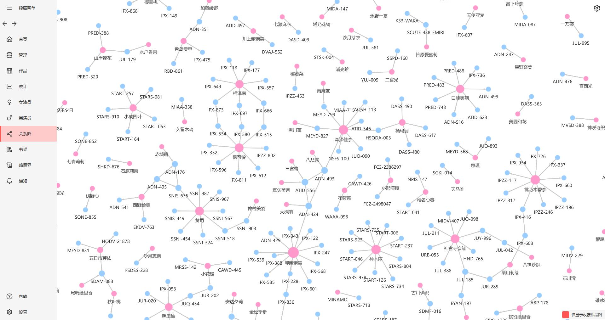
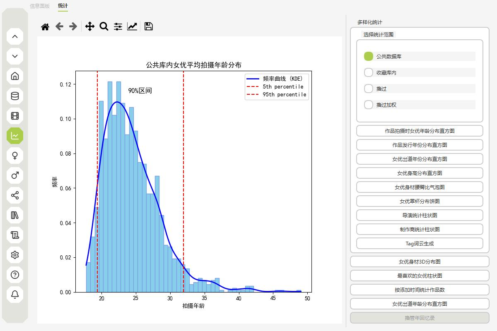

  
  <h1>DarkEye</h1>
  
<strong>洞察与秩序</strong>

  
一个纯本地的个人媒体资料库、元数据编辑器、关系分析器和归档浏览器。

   

[![README · 简体中文][badge-readme-zh-CN]](README.md)
[![README · 繁體中文][badge-readme-zh-TW]](README.zh-TW.md)
[![README · 日本語][badge-readme-ja]](README.ja.md)

![Python][badge-python]
![Framework][badge-framework]
![Platform][badge-platform]
![License][badge-license]
![GitHub last commit][badge-last-commit]
![GitHub release][badge-release]
![GitHub Repo stars][badge-stars]

 

[📖 在线文档][link-docs]
[🎥 视频介绍][link-video]
[🌐 官网][link-website]
[💬 Discord][link-discord]

  <a href="#download">下载与使用</a> •
  <a href="#compliance">合法合规使用声明</a> •
  <a href="#features">特性</a> •
  <a href="#screenshots">界面预览</a> •
  <a href="#privacy">隐私与数据</a> •
  <a href="#migration">迁移与导入</a> •
  <a href="#development">开发与技术</a> •
  <a href="#community">社群</a> •
  <a href="#references">参考项目</a>

---

## 下载与使用

  

  

下载程序并解压，运行 exe 即可；浏览器扩展随软件附带在 `extensions` 目录内。请按下方文档安装**对应浏览器的一种**扩展。

### 浏览器扩展安装

👉 [在线文档：浏览器扩展安装](https://de4321.github.io/darkeye/usage/#_2)

除非浏览器扩展单独更新，一般**不需要**单独下载浏览器扩展。

  
  　　
  

### 使用说明

👉 [在线文档：使用](https://de4321.github.io/darkeye/usage/#_3)

### 版本与更新

👉 [常见问题：更新与迁移](https://de4321.github.io/darkeye/faq/)

设置中可自动更新**软件本体**；软件不会自动更新，但是**插件**会在软件`extensions` 目录更新，需要**手动去浏览器重新加载**。插件另外可在[Releases][link-releases] 手动下载。

迁移版本时请**更新浏览器插件**；

---

## 合法合规使用声明

- 本工具仅用于管理用户依法拥有、已获授权或可合法处理的数据与元信息。
- 使用本工具时，请遵守各国现行法律法规及相关规定。
- 严禁将本工具用于非法抓取、侵权传播、绕过网站访问控制、未经授权处理他人数据等行为。
- 第三方网站内容、接口与访问规则以其平台条款为准，用户应自行确认并承担相应合规责任。

---

## 特性

### 已实现

| **功能** | **说明** | **状态** |
| -------- | -------- | -------- |
| **数据管理** | 影片、女演员、男演员、标签的手动添加与增删查改| ✅ |
| **个人记录** | 自定义记录条目的手动添加与增删查改 | ✅ |
| **分析与图表** | 分析图表与数据展示（仍有部分未完成功能） | ✅ |
| **拟物化DVD盒子陈列** | 拟物化 DVD 陈列与收藏体验 | ✅ |
| **筛选过滤展示** | 筛选作品页面 | ✅ |
| **关联图谱** | 查看关联；约 1 万节点下约 60 帧 | ✅ |
| **翻译** | LLM 翻译 + 一键覆盖翻译 | ✅ |
| **mdcz NFO导入** | [mdcz](https://github.com/ShotHeadman/mdcz)  NFO 导入 | ✅ |
| **Jvedio NFO导入** | Jvedio 数据导出 NFO（测试中） | ✅ |
| **外链跳转** | JSON 驱动外链跳转外部网站，可自定义 | ✅ |
| **本地视频链接** | 如果本地存在视频可将视频链接到数据库中 | ✅ |
| **备份** | 备份系统，用于本地资料归档与恢复 | ✅ |
| **主题** | 主题切换（3D 场景尚不完全跟随时明/暗） | ✅ |
| **截图** | 部分截图能力；女演员界面 `C` 键截图 | ✅ |
| **自动更新** | 自动检测并下载更新 | ✅ |

### 计划与推进中

| **功能** | **说明** | **状态** |
| -------- | -------- | -------- |
| **NFO 导出** | 形成共识后开发；各工具实现不一，当前数据字段仍不齐 | 🔄 |

长期规划与更多细项见 [**更新日志与路线图**](docs/CHANGELOG.md)（随开发滚动更新，不代表固定排期）。

---

## 迁移与导入

### mdcz 项目 NFO 导入

已支持 [mdcz](https://github.com/ShotHeadman/mdcz) 产出的 NFO 导入。

👉 [在线文档：mdcz NFO](https://de4321.github.io/darkeye/usage/#mdcz-nfo)

### Jvedio 迁移数据

👉 [在线文档：Jvedio](https://de4321.github.io/darkeye/usage/#jvedio)

---

## 隐私与数据

- **数据与联网**：默认数据在程序旁的 `data/`（数据库、配置、封面与头像等）。不会主动向第三方上传你的本地资料；联网主要来自刮削与资源拉取，以及可选的更新下载（Cloudflare R2）、翻译（Google 或你自配的 LLM API）等。第三方服务由用户自主启用并自行承担合规责任。

---

## 界面预览

---

## 开发与技术
主要技术基于 PySide6 / Qt Quick 3D、SQLite、本地 FastAPI 与浏览器扩展协同，并含 C++ 力导向图加速。

若想开发，请先阅读下面的文档将软件运行起来。
👉 [开发文档](https://de4321.github.io/darkeye/development/)

---

## 社群

有问题或想法？欢迎加入 Discord：[加入社群][link-discord]

- **新手支持**：文档阅读中有疑问欢迎提问；在线文档持续完善中。
- **提前获知进展**：新功能、开发进展与预发布版本会先在 Discord 讨论。
- **参与方向**：想影响 roadmap，欢迎来讨论。

---

## 参考项目

- [mdcz](https://github.com/ShotHeadman/mdcz)：本地视频名提取番号与 NFO 适配参考
- [Jvedio](https://github.com/hitchao/Jvedio)：数据库接入与导出
- [JavSP](https://github.com/Yuukiy/JavSP)：部分站点爬虫逻辑参考
- [JAV-JHS](https://sleazyfork.org/zh-CN/scripts/558525-jav-jhs)：javdb、FC2 等信息参考
- [JAV_MovieManager](https://github.com/4evergaeul/JAV_MovieManager)
- [stash](https://github.com/stashapp/stash)
- [AMMDS](https://github.com/QYG2297248353/AMMDS-Docker)
- [mdc-ng](https://github.com/mdc-ng/mdc-ng)

---

## 许可证

本项目以 [GNU General Public License v3.0](LICENSE) 授权发布。

---
## Star History

<a href="https://www.star-history.com/?repos=de4321%2Fdarkeye">
 <picture>
   <source media="(prefers-color-scheme: dark)" srcset="https://api.star-history.com/chart?repos=de4321/darkeye&type=date&theme=dark&legend=top-left" />
   <source media="(prefers-color-scheme: light)" srcset="https://api.star-history.com/chart?repos=de4321/darkeye&type=date&legend=top-left" />
   
 </picture>
</a>

## 贡献者

---

DarkEye — 本地资料书架，安全自管。

<!-- Badge images -->

[badge-readme-zh-CN]: https://img.shields.io/badge/README%20%C2%B7%20%E7%AE%80%E4%BD%93%E4%B8%AD%E6%96%87-2ea44f?style=for-the-badge
[badge-readme-zh-TW]: https://img.shields.io/badge/README%20%C2%B7%20%E7%B9%81%E9%AB%94%E4%B8%AD%E6%96%87-555555?style=for-the-badge
[badge-readme-ja]: https://img.shields.io/badge/README%20%C2%B7%20%E6%97%A5%E6%9C%AC%E8%AA%9E-555555?style=for-the-badge
[badge-python]: https://img.shields.io/badge/Python-3.13-blue.svg
[badge-framework]: https://img.shields.io/badge/framework-PySide6%20(Qt6)-orange
[badge-platform]: https://img.shields.io/badge/Platform-Windows-blue
[badge-license]: https://img.shields.io/github/license/de4321/darkeye
[badge-last-commit]: https://img.shields.io/github/last-commit/de4321/darkeye
[badge-release]: https://img.shields.io/github/v/release/de4321/darkeye
[badge-stars]: https://img.shields.io/github/stars/de4321/darkeye?style=social
[badge-downloads]: https://img.shields.io/github/downloads/de4321/darkeye/total

<!-- Links -->

[link-docs]: https://de4321.github.io/darkeye/
[link-video]: https://youtu.be/VCsw1D0ccgY?si=e9typx4kPnzaVFZq
[link-website]: https://de4321.github.io/darkeye-webpage/
[link-discord]: https://discord.gg/3thnEguWUk
[link-releases]: https://github.com/de4321/darkeye/releases
