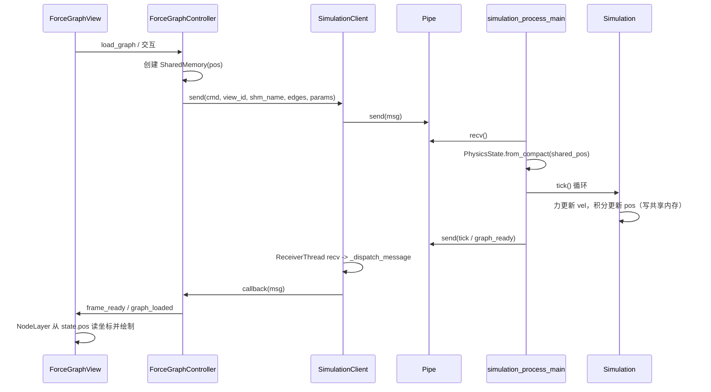

# DarkEye 开发白皮书

## 1. 顶层设计：愿景与定位 (Vision & Philosophy)

**DarkEye (暗眼)** 是一个本地化、隐私导向的 AV 领域元数据管理与情报分析系统。我们的目标不仅仅是管理文件，而是收藏与发掘数字时代地下艺术的价值。

### 核心理念
- **Curator (策展人)**：我们不只是收集番号，我们是在收藏和策展。通过独特的视角，找出最有艺术性的作品。
- **Intelligence (情报)**：从被动的数据记录转向主动的情报挖掘。不仅记录“看了什么”，更通过数据洞察“偏好什么”，挖掘数据背后的联系（如“共演关系”、“新人出道轨迹”）。
- **Privacy First (绝对隐私)**：基于本地优先架构，数据完全私有。具备隐私保护与伪装能力，让用户拥有绝对的安全感。
- **CJK Aesthetics (东方美学)**：专为东方文字设计的竖排 UI，还原阅读实体杂志的沉浸感，带来原汁原味的文化契合度。
- **Zero-Friction (零摩擦)**：极致的自动化采集与整理，让用户感知不到繁琐的录入过程，享受“刷流媒体”般的沉浸体验。

---

## 2. 中层架构：功能矩阵与用户故事 (Features & User Stories)

### 2.1 沉浸式采集 (Immersive Capture)
- **浏览即收藏**：
  通过 Firefox 插件 (`extensions/firefox_capture`) 与本地服务器联动。当你在 JavLibrary 或 JavDB 浏览时，插件会自动检测并同步状态到本地“收件箱”。
  *场景*：在浏览器中看到一部感兴趣的片子，插件图标直接显示“本地未收藏”，点击一下即可推送到 DarkEye，无需复制粘贴。
- **Inbox（收件箱）工作流**：
  采集的数据进入“待处理区”，系统后台自动完成爬虫抓取，元数据清洗。用户只需在闲暇时进行“确认归档”，如同处理邮件一样高效。

### 2.2 智能化管理 (Intelligent Management)
- **拟物化收藏体验**：
  强调仪式感。有封面的作品被包装成实体光盘或杂志的样子，陈列在虚拟书架上。鼠标滑过时可以抽出预览，双击即可播放或查看详情。
- **ForceView 关系网**：
  产品的核心差异化亮点。通过动态的力导向图，展示女优、作品、导演之间的复杂关联网络。
  *场景*：点击一位女优，图谱自动展开她的“朋友圈”——共演过的演员、常合作的导演，帮助用户发现潜在感兴趣的新目标。
- **多维视图与筛选**：
  - **画廊模式**：无边界的卡片流，适合漫无目的地浏览。
  - **时间轴**：按发布时间或收藏时间回顾历史。
  - **Tag 智能筛选**：支持复杂的标签逻辑（必须包含、必须排除），快速定位特定口味的作品。

### 2.3 量化自我 (Quantified Self)
- **贤者模式报告**：
  不仅记录行为（观看、自慰、评分），更分析偏好变化。
  *场景*：系统生成月度报告：“你这个月偏爱 MILF 类型，比上个月增加了 30%；你在周五晚上的活跃度最高。”让用户通过数据重新认识自己的性癖好。

### 2.4 极致安全 (Ultimate Privacy)
- **一键伪装 (Panic Button)**：
  按下快捷键，整个界面瞬间切换为 Excel 报表或代码编辑器界面，从容应对突发查岗。
- **本地化存储**：
  所有数据（包括图片、数据库）均存储在本地 `resources/` 目录下，不上传云端，确保绝对隐私。

---

## 3. 底层实现：技术栈与规范 (Tech Stack & Standards)

### 3.1 技术架构 (Architecture)
- **UI Framework**: PySide6 (Qt for Python) - 利用其强大的绘图引擎 (QGraphicsView) 实现 ForceView 和高性能卡片流。
- **Backend**: FastAPI (Local Server) - 作为本地微服务，处理浏览器插件请求、爬虫任务调度和后台数据处理。
- **Database**: SQLite + SQLAlchemy - 轻量级、单文件 (`public.db`, `private.db`)，便于备份和迁移。
- **Crawler**: 模块化爬虫系统 (`core/crawler`) - 支持 JavBus, JavDB, Minnano, Fanza 等多源数据抓取与清洗。

### 3.2 目录结构说明
- `main.py`: 应用程序入口。
- `core/`: 核心业务逻辑（爬虫、数据库模型、推荐算法）。
- `ui/`: 界面层，按功能模块划分 (`pages/`, `widgets/`)。
- `server/`: 本地 API 服务器，处理外部交互。
- `extensions/`: 浏览器插件源码。
- `resources/`: 静态资源与数据存储。

### 3.3 开发规范 (Guidelines)
- **代码风格**：
  - 强制使用 Type Hints，减少运行时错误。
  - 核心逻辑必须编写单元测试 (`tests/` 或 `manual_tests/`)。
- **UI 设计原则**：
  - 优先使用 `QGraphicsView` 实现复杂交互。
  - 坚持 CJK 竖排美学，针对高分屏进行适配。
  - 样式与逻辑分离，统一管理颜色和字体配置。
- **数据层规范**：
  - 逐步从原始 SQL 拼接迁移到 Repository 模式。
  - 引入实体模型 (Domain Models) 替代字典传递。

### 3.4 插件化架构 (Plugin Architecture)
- 核心功能（仓库管理、模型定义）与扩展功能（爬虫、图表绘制）解耦。
- 支持第三方编写爬虫插件或数据分析插件，增强系统的可扩展性。

---

## 4. 路线图与里程碑 (Roadmap)

### Phase 1: 策展人更新 (The Curator Update) - *Current Focus*
- [ ] **无限卡片流首页**：替换现有欢迎页，实现高性能的水平滚动卡片流。
- [ ] **CJK 竖排 UI**：在卡片详情和部分标题中实现竖排排版。
- [ ] **Inbox 模式重构**：改造手动录入流程，引入“待处理”队列。

### Phase 2: 情报网更新 (The Intelligence Update)
- [ ] **浏览器插件双向通信**：网页端实时显示本地收藏状态（已看/未看）。
- [ ] **关注订阅系统**：实现女优/片商的新作预告推送。
- [ ] **多源数据融合**：完善 ID 解析与去重逻辑，提升元数据准确性。

### Phase 3: 隐形人更新 (The Invisible Update)
- [ ] **Excel 伪装模式**：实现一键 UI 切换功能。
- [ ] **数据加密**：为私有数据库 (`private.db`) 增加加密支持。
- [ ] **贤者报告**：开发基于用户行为的数据分析与可视化模块。

### 长期目标
- **i18n 支持**：全面支持简中、繁中、日文、韩文。
- **社区生态**：开放插件市场，分享爬虫规则和分析模型。

# 待优化
番号补全按需加载或分页
[作品 1240]  [女优 312]  [代表作 186]  [近30天 +42] 知道数据库的规模
最近看过的 5～10 部
最近入库的作品
最近新增的女优

待处理事项：
- 12 部作品没有封面
- 8 部作品未绑定女优
- 3 位女优没有代表作
随机推荐一部

首页可配置

# 力导向图模拟与显示架构分析与修改建议

## 1. 架构概览

- **主进程**：`simulation_process_main.py` 负责启动子进程并返回 `Pipe` 的一端；`ForceGraphView` + `ForceGraphController` 负责建图、创建共享内存、发命令、收事件并驱动渲染。
- **子进程**：`simulation_worker.py` 中的 `simulation_process_main(conn)` 循环：收命令（init/load/close/restart/set_*/set_dragging）、维护多 session（每 view_id 一个 `SimContext`）、对活跃 session 调用 `Simulation.tick()`，并通过共享内存更新 `pos`。
- **共享数据**：仅位置 `pos (N,2) float32` 使用 `shared_memory.SharedMemory`；边与参数通过 Pipe 消息传递，Worker 内用 `PhysicsState`（pos 指向 shm.buf）做力学积分。