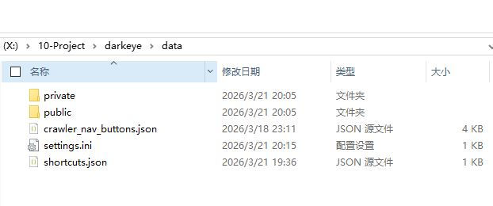

## 版本更新

### 1.1.1之前
所有的数据库文件均在`resources/public`和`resources/private`这两个文件夹的下面。

在没有数据库迁移工具时只能手动复制主要的文件夹，`resources/public`和`resources/private`，把对应的文件夹移动到新版本的对应的位置就行了。

有迁移工具后，点击备份私库与公库，然后选择电脑上的一个位置，用新的版本点击还原后选择对应的meta.json和.db文件然后重启软件。现在暂时做不到无缝，总有问题。

还有就是settings.ini这个配置文件里面存了包括界面颜色，视频文件夹地址等信息，也一并移动过去。

现在绿色版只能是这样来版本迁移，后面如果有安装版应该是自动版本迁移。

### 迁移到1.1.2
1.1.2以前数据库文件均在`resources/public`和`resources/private`，之后需要把这两个文件移动到`data`下面，然后把settings.ini也移动到`data`文件夹下面。
`data`文件夹下面还有
- `settings.ini` 设置
- `shortcuts.json`用户自定义快捷键
- `crawler_nav_buttons.json`json驱动的外链，用户可以自行编辑网站
迁移后这个文件夹应该长这样

### 自动更新
1.1.2后有自动更新机制，每周五晚上6点检查一次是否有新版本，有可以点击更新，目前下载速度很慢，还在检查问题，如果不行。就去github的release上下载最新的，然后点击`使用本地安装包更新` 

### 手动下载包体更新
实际上更新就是把data文件夹整体换到新的软件本体里面就行了。

这个手动下载包体只是一种看起来更新优雅的方式，但是实际上并没有什么用。

## 为什么FC2等捕捉不完善？
因为软件主要为正规影片爬虫设计，测试连续爬60部正规的没问题，数据全部采集到，非正规的需要后面添加爬虫能力

## 翻译不准？
现在的翻译用的是javtxt上的机翻，如果上面没有用的是google翻译，确实不准，后面看情况用更好的翻译方案。

## CPU占用率高？
因为力导向图计算时大于1000节点后默认并行计算吃满CPU，所以CPU占用率会升很高，不过没有关系，力导向图很快收敛就会停止计算。CPU又正常了。如果要支持1w+这个后期会改成纯GPU计算，现在只是CPU算加GPU显示。