## 下载软件

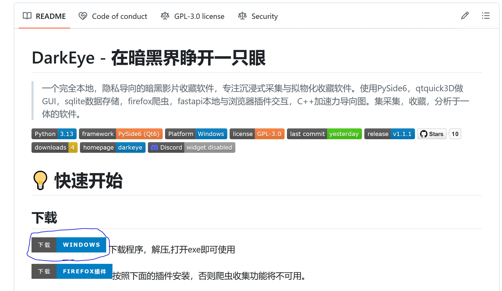 把下面的插件也下载了。

## 安装浏览器插件

这里以「本地加载已解压扩展」为主，不需要商店账号。三种浏览器可以同时安装，但**建议只启用一种进行自动采集**，避免重复打开页面。

### Firefox 插件

1. 打开 Firefox，地址栏输入：`about:debugging#/runtime/this-firefox`
2. 点击页面中的 **「临时加载附加组件」**（或「Load Temporary Add-on」）。
3. 在文件选择对话框中，定位到仓库目录下：`extensions/firefox_capture/manifest.json`，选中并打开。
4. 右上角会出现 `DarkEye Capture` 图标：
   - 看到图标说明加载成功。
   - 关闭浏览器或重启后需要**重新临时加载**

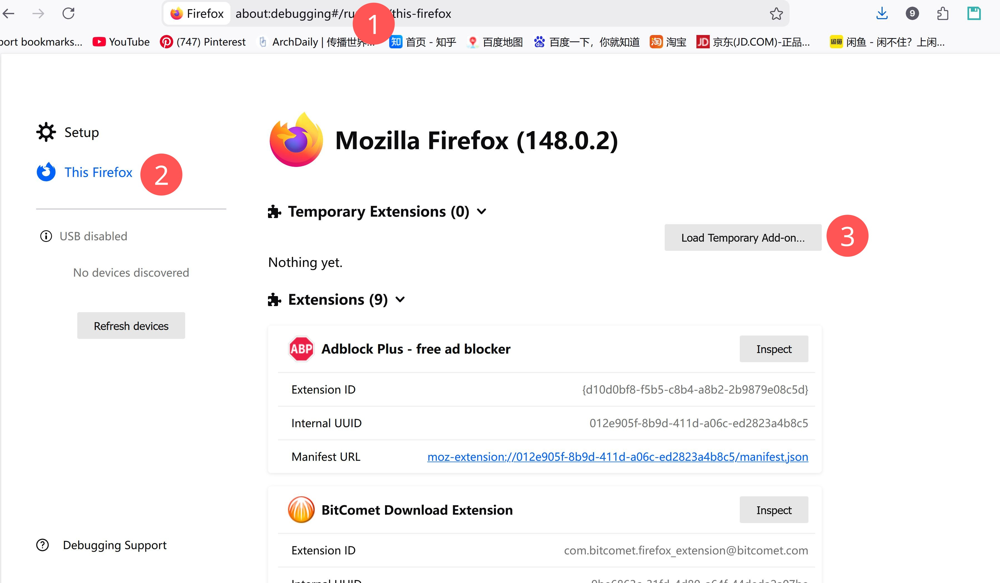
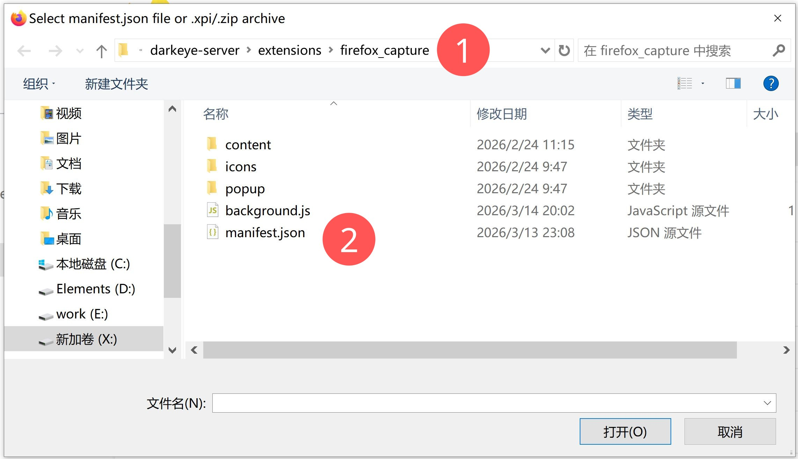


### Chrome 插件

1. 打开 Chrome，地址栏输入：`chrome://extensions/`
2. 右上角开启 **「开发者模式」**。
3. 点击左上角 **「加载已解压的扩展程序」**（Load unpacked）。
4. 在文件选择对话框中，选择目录：`extensions/chrome_capture`，然后确认。
5. 在扩展列表中确认：
   - 出现 `DarkEye Capture`，且开关为开启状态。
   - 点击「详情」可以看到：
     - 背景页类型为 *Service Worker*；
     - 有一个 Offscreen 文档在运行（用于接收软件端下发的自动采集指令）。

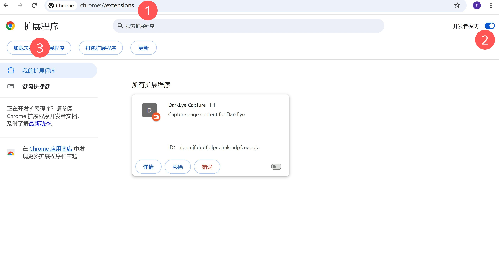
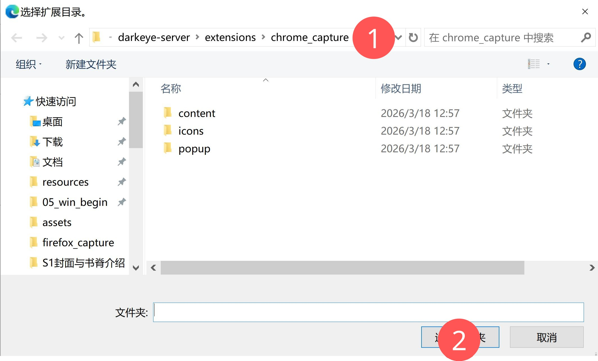

### Edge 插件

Edge 基于 Chromium，可以直接复用 `extensions/chrome_capture` 目录：

1. 打开 Edge，地址栏输入：`edge://extensions/`
2. 左下角开启 **「开发人员模式」**（Developer mode）。
3. 点击 **「加载解压缩的扩展」**（Load unpacked）。
4. 在文件选择对话框中，选择目录：`extensions/chrome_capture`，然后确认。
5. 在扩展列表中确认 `DarkEye Capture` 已启用。

> 提示：  
> - 若你只想让 **Firefox 自动采集**，可以在 Chrome / Edge 中关闭 `DarkEye Capture` 扩展的开关；  
> - 若只想用 **Chrome/Edge 自动采集**，可以在 Firefox 的附加组件管理中禁用 `DarkEye Capture`，避免多个浏览器同时响应同一条爬虫指令。

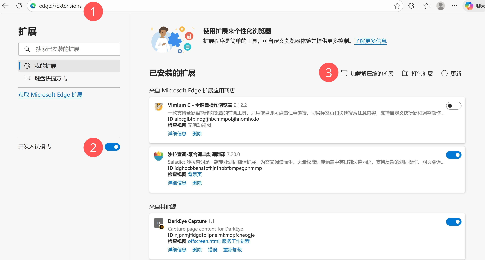


## 如何添加新作品信息
目前有 三种主要方式，普通用户推荐第 1 种。

### 方式一：用浏览器插件采集（推荐）
适合：你平时在 javdb / javlibrary / javtxt 上逛片子。

步骤：

确保：
DarkEye 软件已启动
Firefox 插件已加载（上一节的步骤）
在 Firefox 打开其中任意一个网站，例如 javdb

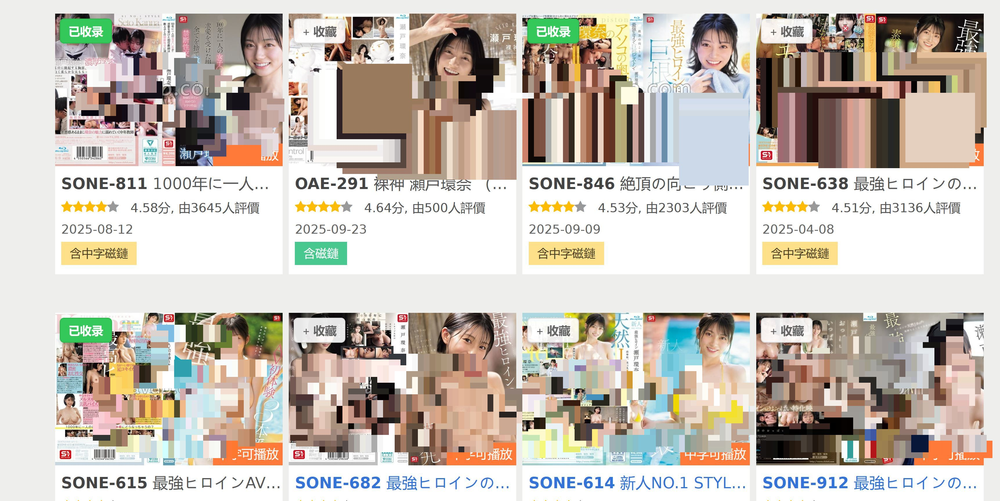
在网页上浏览某个作品详情页


如果插件与软件都正常启动，软件有收藏按钮悬浮于作品上，点击收藏开始开始爬取该作品的信息，写入本地数据库。

现在爬虫采用浏览器爬虫，会弹出javlib，需要先手动过反爬。第一次访问 javlibrary 时，可能会被 Cloudflare 挡一下，手动点一次通过即可，之后约 20 分钟内都不需要再过盾。采集的内容包括：发布时间、导演、中/日文标题、剧情简介、女优、男优、标签、封面等。


### 方式二：从本地视频反向识别

适合：你本地已经有大量视频，希望让软件尽量自动识别番号并入库。

在软件中打开：设置 -> 视频
添加你存放影片的文件夹路径（可以多个）
旧版打开：管理 -> 批量操作 -> 查找本地视频并录入添加

新版直接在设置路径下面点击查找本地视频并录入添加

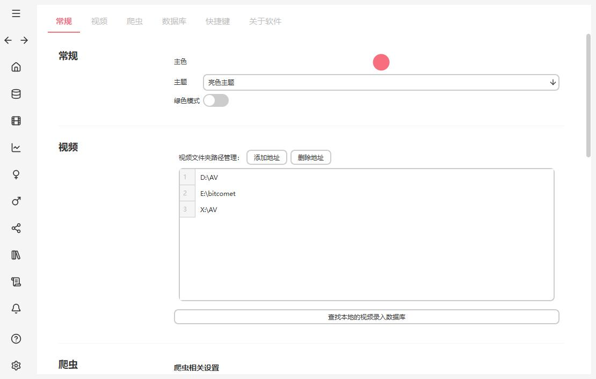
软件会：

扫描你设置的文件夹

从文件名中尝试提取番号,把识别到的结果放入爬虫队列，慢慢去网上补全信息（约 20 秒一次请求）

重要提示：

测试下来大概连续100次爬虫会触发javdb的反爬，然后就不行了。如果有上千部片子，挂半小时休息半小时，然后慢慢爬。

这一步的识别准确度目前不高，只是帮你省一点力气。

建议在「管理 -> 添加/修改作品」里，后面手动检查和修正关键信息。


### 方式三：纯手动添加番号

适合：看到一个想记下来的番号，或者需要补录特别的作品。

在软件任何地方按下快捷键：W
会弹出「快速添加作品」窗口
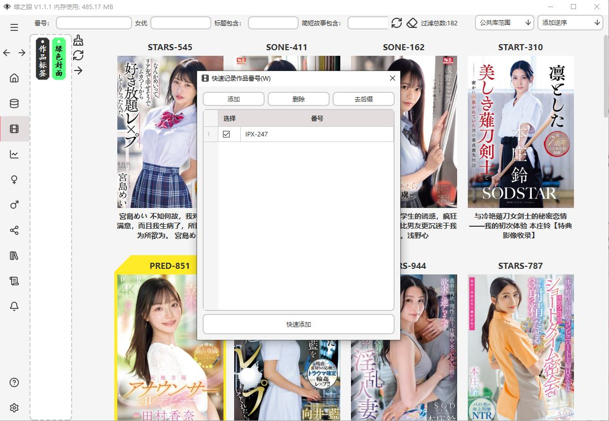
输入标准的番号一定要大写，然后点击添加，爬虫会自动的去整理


### 导入 mdcz nfo文件

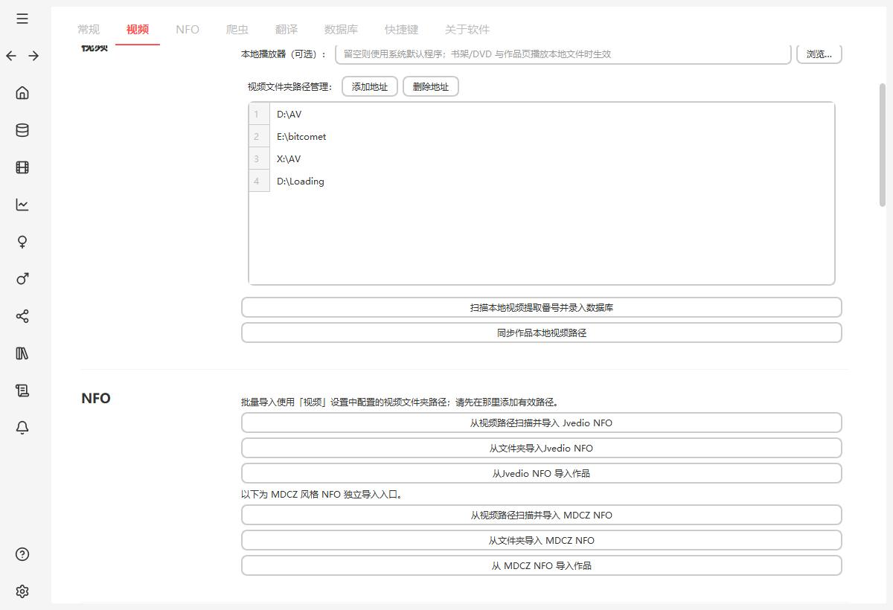
在设置的这个界面，可以现在视频地址上加入，然后扫描导入就行。


### 导入jedio NFO文件

标准NFO文件的格式参考 https://kodi.wiki/view/NFO_files/Templates 其中的movie

举例单个的nfo的格式要是这个样子
```
<?xml version="1.0" encoding="UTF-8" standalone="yes"?>
<movie>
  <source>https://javdb.com/v/zkAxQ</source>
  <plot>
  </plot>
  <title>神回！神回！！神回！！！…ハリウッドか！って位の世界観！！！雨のネオン街を颯爽と歩く謎のフルフェイス全身ラバー美女！！！…ブレードランナーか！！！これが激レアなんです！！！そしてこんな格好で外歩く様な女はアッチ(セックス)の方もスゲーに決まってるんです！！！年初めにこんな〝どエロい〟女見たらもぉ普通のAV見れなくなっちゃうから気をつけて！！！マジ半端ないエロさです！！！：夜の巷を徘徊する〝激レア素人〟！！ 11</title>
  <director>
  </director>
  <rating>0</rating>
  <criticrating>
  </criticrating>
  <year>2019</year>
  <mpaa>
  </mpaa>
  <customrating>
  </customrating>
  <countrycode>
  </countrycode>
  <premiered>2019-01-03</premiered>
  <release>2019-01-03</release>
  <runtime>94</runtime>
  <country>
  </country>
  <studio>プレステージプレミアム(PRESTIGE PREMIUM)</studio>
  <id>MIUM-359</id>
  <num>MIUM-359</num>
  <genre>HDTV</genre>
  <genre>苗條</genre>
  <genre>蕩婦</genre>
  <genre>巨乳</genre>
  <genre>美臀</genre>
  <genre>女優按摩棒</genre>
  <tag>夜の巷を徘徊する激レア素人</tag>
  <thumb>C:\Users\yin\Desktop\BigPic\MIUM-359.jpg</thumb>
  <thumb>E:\Jvedio-5.3.1\data\Daxoel\pic\SmallPic\MIUM-359.jpg</thumb>
  <fanart>
    <thumb preview="https://c0.jdbstatic.com/samples/zk/zkAxQ_l_0.jpg">https://c0.jdbstatic.com/samples/zk/zkAxQ_l_0.jpg</thumb>
    <thumb preview="https://c0.jdbstatic.com/samples/zk/zkAxQ_l_1.jpg">https://c0.jdbstatic.com/samples/zk/zkAxQ_l_1.jpg</thumb>
    <thumb preview="https://c0.jdbstatic.com/samples/zk/zkAxQ_l_2.jpg">https://c0.jdbstatic.com/samples/zk/zkAxQ_l_2.jpg</thumb>
    <thumb preview="https://c0.jdbstatic.com/samples/zk/zkAxQ_l_3.jpg">https://c0.jdbstatic.com/samples/zk/zkAxQ_l_3.jpg</thumb>
  </fanart>
  <actor>
    <name>二宮和香</name>
    <thumb>https://www.javsee.in/pics/actress/p37_a.jpg</thumb>
  </actor>
  <actor>
    <name>森林原人</name>
    <thumb>https://c0.jdbstatic.com/avatars/pp/PpQ0.jpg</thumb>
  </actor>
</movie>
```

这样子就可以导入进来。

在设置->导入单个NFO数据


### 从Jvedio把数据转过来
目前感谢[4965898](https://github.com/4965898)老哥写了脚本，通过运行脚本可以把Jvedio的数据导出nfo，然后导入本软件

https://raw.githubusercontent.com/de4321/darkeye/refs/heads/main/scripts/jvideo2nfo.py

浏览器打开后右键保存py文件

或者打开仓库位置在scripts/jvideo2fno.py 下载下来

修改下面的两个位置
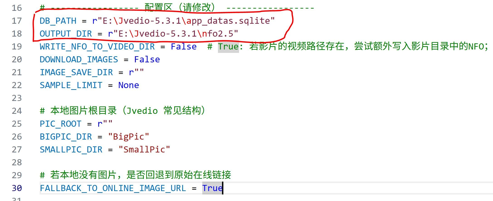

使用Python运行脚本，产生一个包含nfo的闻文件夹

然后通过方式四导入本软件就行了。


## 作品信息不完整？
比如没有封面的，没有标题的，还有fc2那种啥都没有的，因为爬虫的网站没有对应的信息。此时可以右键点击进入编辑区


点击下面的四个链接看看有没有信息，如果没有就代表爬虫无这部作品的信息源，如果有代表爬虫有问题或者是网络问题，此时可以在左边的爬虫区补数据。
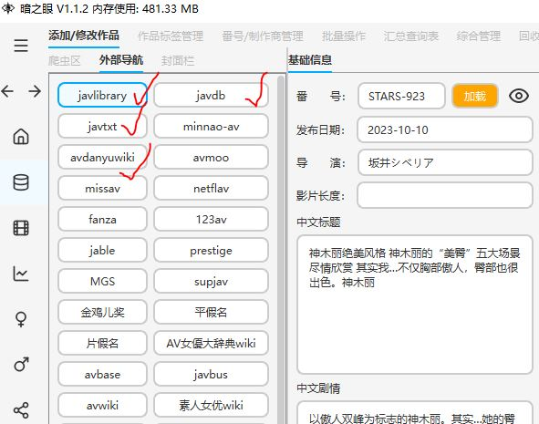

## 如何补充快速缺失的信息？

这里缺失的信息是目标网站有的，但是因为网络问题没有爬到，然后可以补充，网站上没有的东西只能手动修改。

按W键，弹出下面的界面
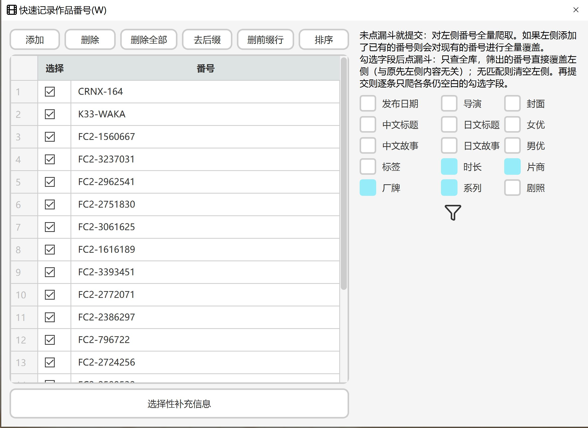

在右侧选择要补充的信息，然后点击漏斗就行了，注意建议左侧排除那些没有信息的，比如FC2等等。

会判断哪个字段是缺少的，然后爬虫爬好后只覆盖缺少的字段。字段之间的关系是或。比如影片A只缺少了时长，影片B只缺少了片商，如果此时选了时长和片商，则会把A和B都添加到爬虫里面去，然后最后只更新A的时长和B的片商，其他原本有的不会被覆盖。

如果要覆盖原来的，那么就只能点击到作品编辑页，通过这个爬虫去爬取，会覆盖，供你确认。


## 如何修改作品信息？


- 点击番号可复制

- 左键点击是跳转作品详情页

- 右键点击是跳转作品修改页

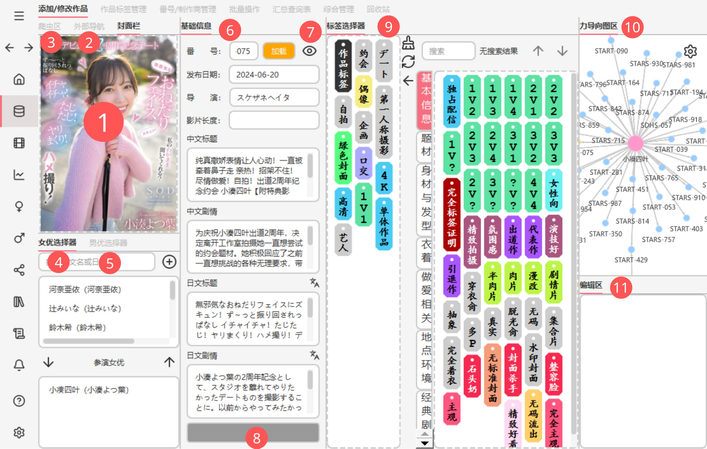
1. 封面栏可点击找本地的图片或者直接把javlib的图片拖进来，右键可以打开本地的图片位置

2. 外部导航可以导航到不同的网站

3. 可选爬虫，爬后会更新这个页面，更新后有橙框提示并可提交修改

4. 女优选择器

5. 男优选择器

6. 基础信息

7. 可跳转到详情页

8. 提交按钮

9. 标签选择器，左栏是标签

10. 关系图，可点击跳转

11. 编辑区，可写感受，影评，然后可通过`[[ ]]` 链接到其他的作品，并在力导向图区中显示。

修改可以自由的编辑，主要是这个爬虫区

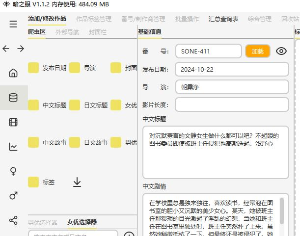
这个爬虫区可以补充信息，如果这个信息是网上有的只是因为网络问题没下来，选合适的，然后点击下载。更新后会有橙色的提示。然后可以提交并修改。


## 如何修改女优信息？
当你看见大量的灰色按钮时？不要慌，点击`管理->批量操作->更新标记需要更新的女优`。爬虫会自动处理，但是爬虫不是万能的会有问题，比如遇到下面的奇怪的情况。左键进入
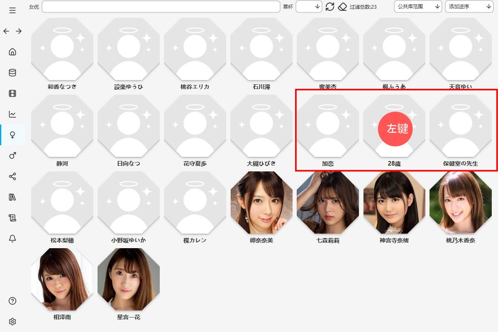

右键进入作品编辑区
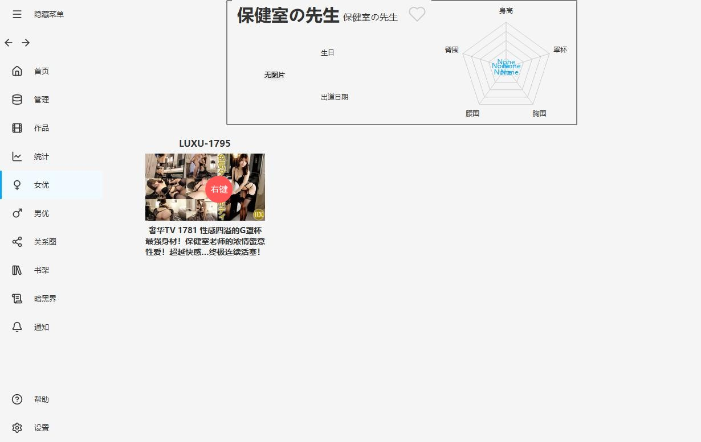

在下面的女优选择区把奇怪的东西全移出，然后保存。
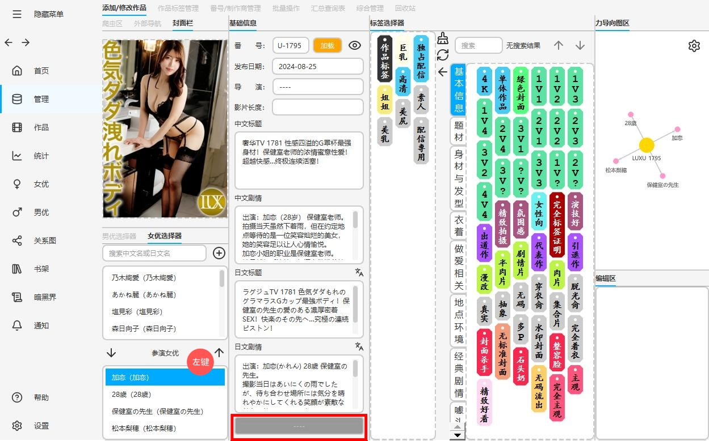

然后回到这个奇怪的女优区，右键进入编辑
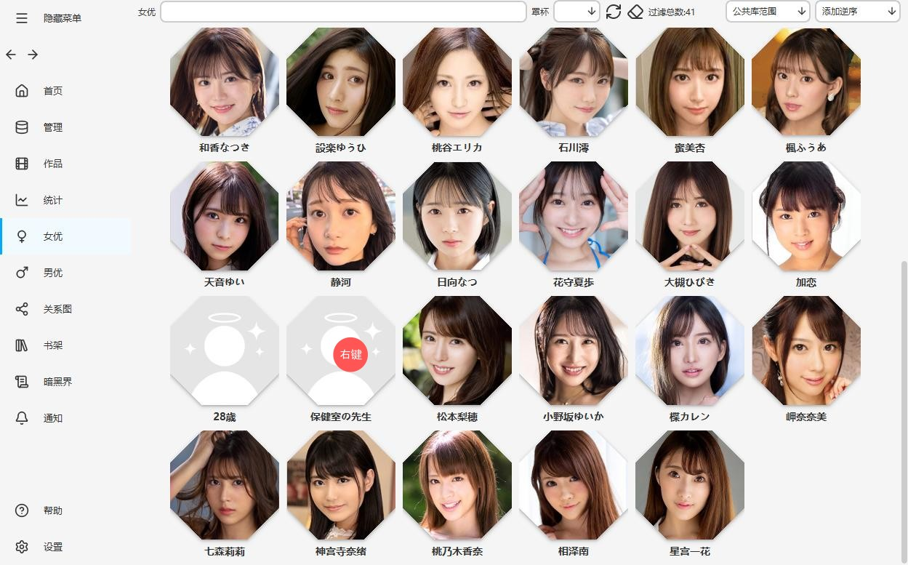

点击删除按钮，把女优删除
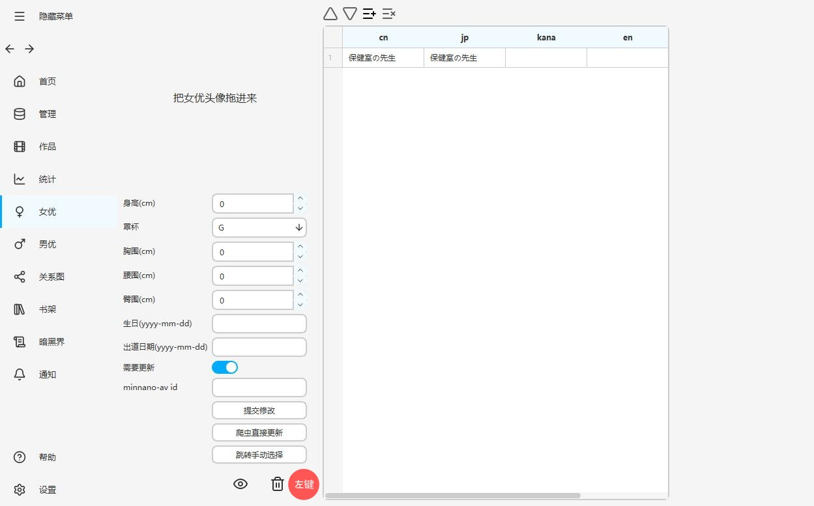

## 女优爬虫后还是灰色的？
说明要么是错误爬虫，要么是遇到搜索结果很多的情况了，右键点击编辑
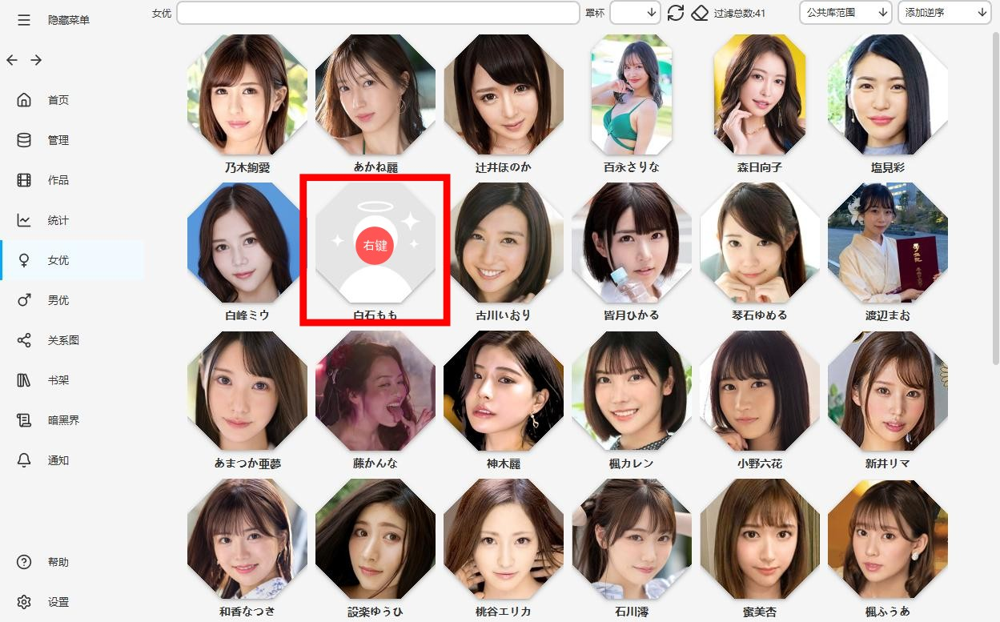

点击跳转
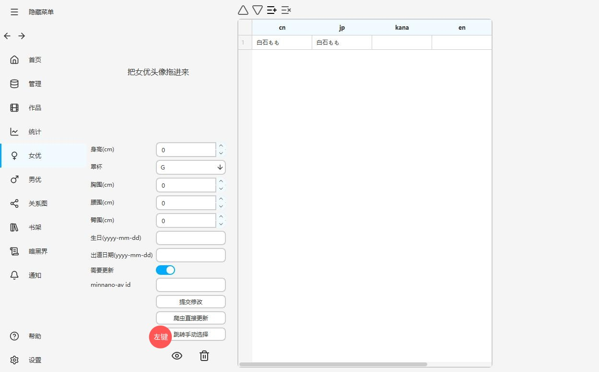

选择正确的女优，点击


如果装了插件，右下角会有一个采集按钮，点击


采集后信息会更新到面板上，然后点击提交就行，右边的中文需要自己慢慢编辑，最顶上的就是有优先显示的。现在默认显示的名字是cn最上面一栏，现在就是白石もも


## 男优是灰的？
这个没有办法，只能手动收集信息。


## 自定义外部链接
现在的外部链接是json驱动的

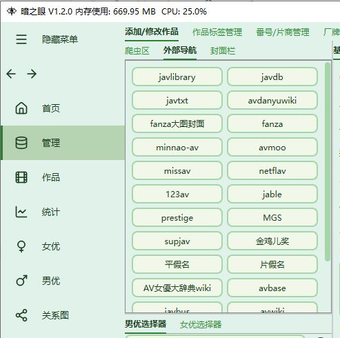


要自定义，就打开`data/crawler_nav_buttons.json`这个json文件
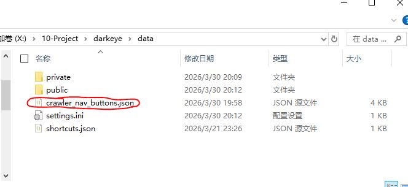

单个的例子，包括名字，要跳转的url与description,包括{serial}特殊记号，有了这个记号，就会从当前页面中取出这个番号输入
```
  {
    "name": "javtxt",
    "url": "https://javtxt.com/search?type=id&q={serial}",
    "description": "获得故事与标题，但是没有封面"
  },
```

下一个例子,有的网站只接受fanza的那个id比如ipx00247查询的，就多加一行`"serial_transform": "fanza",`
```
  {
    "name": "fanza",
    "url": "https://www.dmm.co.jp/search/=/searchstr={serial}/limit=30/sort=rankprofile",
    "serial_transform": "fanza",
    "description": "fanza售卖网站，非日本本土，需日本vpn且特殊插件才能访问"
  },
```

强烈建议把这个例子加上可以更好的帮你定位大图，老用户需要手动添加。
```
  {
    "name": "fanza大图封面",
    "url": "https://awsimgsrc.dmm.co.jp/pics_dig/digital/video/{serial}/{serial}pl.jpg",
    "serial_transform": "fanza",
    "description": "fanza大图封面可能链接"
  },
```


## LLM翻译的使用
当选择LLM翻译时，爬虫会自动抛弃中文标题与故事，根据日文标题与故事自动翻译，而且不会降级成Google，失败就是空的，这一点后面补充就行了。

### 外购API
这个有钱就可以现在是兼容OpenAi的

### 本地搭建（推荐）

以本地有张5060(8G)为例。
使用llama.cpp或者ollama
下载已经编译好的版本，没有显卡的选择纯cpu推理，有显卡的选择对应cuda版本或者vulkan

https://github.com/ggml-org/llama.cpp/releases

下载gguf模型

https://huggingface.co/SakuraLLM/Sakura-7B-Qwen2.5-v1.0-GGUF/tree/main
或者下面的这个，下面的模型更大更新，效果更好。
https://huggingface.co/SakuraLLM/Sakura-14B-Qwen3-v1.5-GGUF

下载q4量化的gguf文件，或者其他的LLM大模型，现在更强可以下载更大的。小的下载更好的

#### llama.cpp

先打开软件中的 `设置 -> 翻译`，使用 **llama.cpp 辅助启动**：

1. 点击 `打开 llama.cpp Releases` 下载对应平台的 `llama-server.exe`
2. 填写 `llama-server.exe` 与 `GGUF 模型` 路径
3. 选择模式与预设（推荐先用 `自动(推荐)` 或 `8G 显卡预设`）
4. 点击 `启动 llama-server`
5. 点击 `测试 /v1/models`，确认服务可用后会自动回填翻译配置
6. 回到上方点 `测试翻译` 验证效果

排障建议：

- 显存不足：先降低 `gpu-layers`，或改用 `低显存预设/CPU 预设`
- 端口占用：改 `port` 或关闭占用程序
- 本地模式 `API Key` 可以随便填（例如 `local`）

如果你习惯命令行，继续看下面的手动命令方式。

运行参数

在powershell中，定位到编译好的llama-server.exe的位置，修改下面`E:\LLM\sakura-7b-qwen2.5-v1.0-iq4xs.gguf`这个具体模型的位置，然后运行
```
llama-server.exe --host 0.0.0.0 --port 8080 --model E:\LLM\sakura-7b-qwen2.5-v1.0-iq4xs.gguf -c 2048  -n 512 --gpu-layers 99 --batch-size 512 --ubatch-size 256 --threads 6 --cache-type-k q8_0  --cache-type-v q8_0  --no-mmap --mlock --flash-attn 'on' 
```

按照入下设置

BaseURL输入
```
http://127.0.0.1:8080/v1
```
模型的名字一般就是本地那个gguf的名字
或者可以在浏览器输入`http://127.0.0.1:8080/v1/models`查看模型的名字

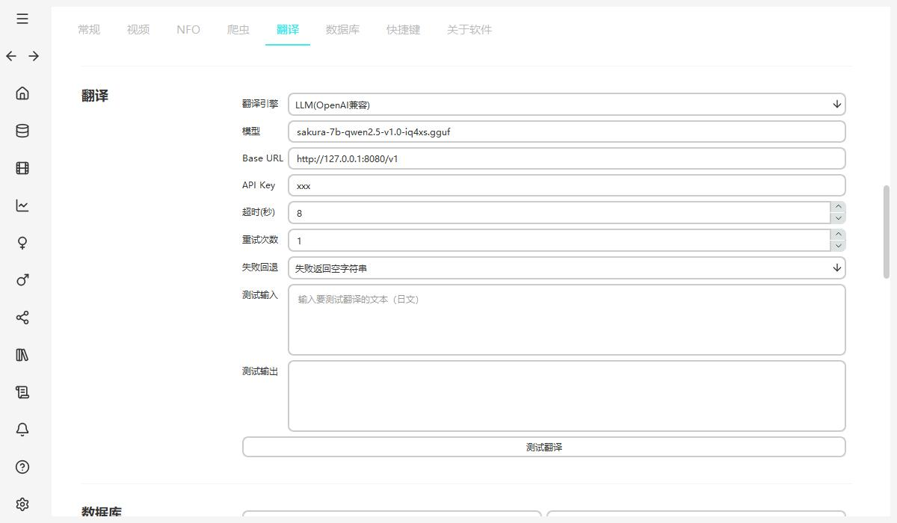

其中本地运行时没密码，随便输入一个，然后测试一下翻译的好坏。

在`管理`->`批量操作`->`一键翻译标题/简介`或者`覆盖翻译标题/简介`


## 数据备份
数据备份分全量数据与精简备份

